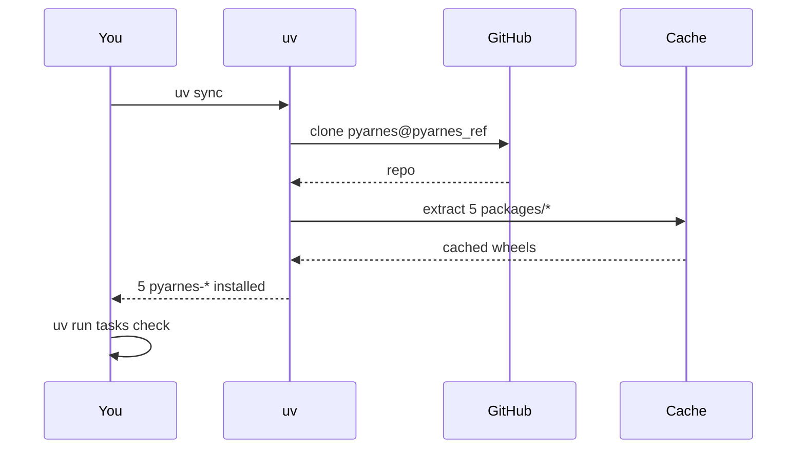

# Install & verify

This page assumes you have already run `uvx copier copy gh:Cognitivemesh/pyarnes my-agent`. If not, start with [Scaffold a project](scaffold.md).

## Install flow



## Prerequisites

- **Python 3.13+** — pyarnes uses modern Python features (slots, frozen dataclasses, match statements)
- **[uv](https://github.com/astral-sh/uv)** — fast Python package manager with workspace support

## Install from your scaffolded project

```bash
cd my-awesome-agent
uv sync
```

This resolves the five `pyarnes-*` packages from git URLs pinned to your chosen `pyarnes_ref`:

| Package | What it provides |
|---|---|
| `pyarnes-core` | Error types, lifecycle FSM, JSONL logging |
| `pyarnes-harness` | Agent loop, tool registry, output capture |
| `pyarnes-guardrails` | Path, command, and tool-allowlist safety checks |
| `pyarnes-bench` | Evaluation scoring framework |
| `pyarnes-tasks` | Cross-platform task runner |

## Verify installation

```bash
uv run tasks check    # runs lint + typecheck + any tests you have
```

You should see a clean pass:

```text
Results (0.6s):
    0 passed        # (or however many tests you have)
```

## Next step

Build your first tool, loop, and guardrail → [Quick start](../build/quickstart.md).
