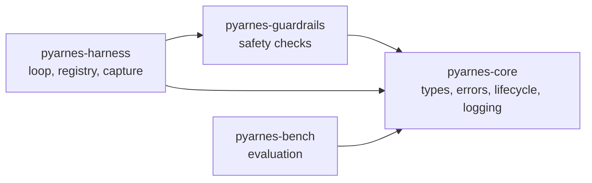

# Packages overview

pyarnes ships four runtime packages plus a task runner. You import what you need; the dependency graph is minimal.

## Dependency graph



`pyarnes-core` is the foundation — every other package depends on it for error types and logging.

## pyarnes-core

The foundation package that all other pyarnes packages depend on.

| Module | Key classes | Purpose |
|---|---|---|
| `pyarnes_core.types` | `ToolHandler`, `ModelClient` | Abstract base classes for tools and LLM clients |
| `pyarnes_core.errors` | `HarnessError`, `TransientError`, `LLMRecoverableError`, `UserFixableError`, `UnexpectedError` | Four-error taxonomy for structured failure routing |
| `pyarnes_core.lifecycle` | `Phase`, `Lifecycle` | Finite-state machine for session tracking |
| `pyarnes_core.observe.logger` | `LogFormat`, `configure_logging()`, `get_logger()` | Structured JSONL logging via loguru |

**Dependencies:** `loguru` — the only runtime dependency.

```python
from pyarnes_core.errors import TransientError
from pyarnes_core.lifecycle import Lifecycle
from pyarnes_core.observe.logger import configure_logging, get_logger
from pyarnes_core.types import ToolHandler, ModelClient

# Configure logging at startup
configure_logging(level="INFO", json=True)

# Get a logger
logger = get_logger(__name__)
logger.info("starting up")
```

Reference: [pyarnes-core deep dive](../../maintainer/packages/core.md) · [error taxonomy](../evaluate/errors.md) · [lifecycle](../evaluate/lifecycle.md) · [logging](../evaluate/logging.md)

## pyarnes-harness

The runtime engine that drives agent execution.

| Module | Key classes | Purpose |
|---|---|---|
| `pyarnes_harness.loop` | `AgentLoop`, `LoopConfig`, `ToolMessage` | Core async agent loop with structured error handling |
| `pyarnes_harness.tools.registry` | `ToolRegistry` | Named handler discovery and validation |
| `pyarnes_harness.capture.output` | `CapturedOutput`, `OutputCapture` | Record tool stdout, stderr, return values, and errors |
| `pyarnes_harness.capture.tool_log` | `ToolCallEntry`, `ToolCallLogger` | JSONL file logger for tool invocations |
| `pyarnes_harness.guardrails` | Re-exports from `pyarnes-guardrails` | Backwards compatibility |

### How the loop works

1. Ask the model for the next action
2. If `final_answer` → stop and return messages
3. If `tool_call` → dispatch to the handler
4. Handle errors according to the taxonomy (retry, feedback, interrupt, or crash)
5. Append the tool result to messages and go back to step 1
6. If `max_iterations` reached → stop and return messages

**Dependencies:** `pyarnes-core` · `pyarnes-guardrails` · `returns`, `toolz`, `more-itertools`, `funcy` (functional utilities).

Reference: [pyarnes-harness deep dive](../../maintainer/packages/harness.md) — covers the agent loop, tool registry, and capture system.

## pyarnes-guardrails

Composable safety guardrails that validate tool calls before execution.

| Class | Purpose |
|---|---|
| `Guardrail` | Abstract base class — implement `check()` for custom guardrails |
| `PathGuardrail` | Block access to paths outside allowed roots |
| `CommandGuardrail` | Block dangerous shell commands (sudo, rm -rf /, etc.) |
| `ToolAllowlistGuardrail` | Only allow pre-approved tool names |
| `GuardrailChain` | Stack multiple guardrails — first violation stops the chain |

Every guardrail has a single method:

```python
def check(self, tool_name: str, arguments: dict[str, Any]) -> None:
    ...
```

- If the call is safe → returns `None`
- If the call is dangerous → raises `UserFixableError` with a message and prompt hint

**Dependencies:** `pyarnes-core` — `UserFixableError` error type and logging.

Reference: [pyarnes-guardrails deep dive](../../maintainer/packages/guardrails.md)

## pyarnes-bench

Evaluation and benchmarking toolkit for scoring agent outputs.

| Class | Purpose |
|---|---|
| `EvalResult` | Immutable record of a single evaluation (scenario, expected, actual, score, passed) |
| `EvalSuite` | Collect, run, and summarise batches of evaluations |
| `Scorer` | Abstract base class — implement `score(expected, actual) -> float` |
| `ExactMatchScorer` | Built-in scorer: 1.0 if equal, 0.0 otherwise (optional case-insensitive) |

```python
from pyarnes_bench import EvalResult, EvalSuite, ExactMatchScorer

scorer = ExactMatchScorer(case_sensitive=False)
suite = EvalSuite(name="my-eval")

score = scorer.score("Hello", "hello")  # 1.0 (case-insensitive)
suite.add(EvalResult(scenario="greeting", expected="Hello", actual="hello", score=score, passed=True))

print(suite.summary())
# {"suite": "my-eval", "total": 1, "passed": 1, "failed": 0, "pass_rate": 1.0, "average_score": 1.0}
```

Writing a custom scorer:

```python
from pyarnes_bench import Scorer

class FuzzyScorer(Scorer):
    def score(self, expected, actual) -> float:
        # Your fuzzy matching logic here
        ...
```

**Dependencies:** `pyarnes-core` — logging.

## pyarnes-tasks

The cross-platform task runner — full reference at [Task runner](tasks.md).
