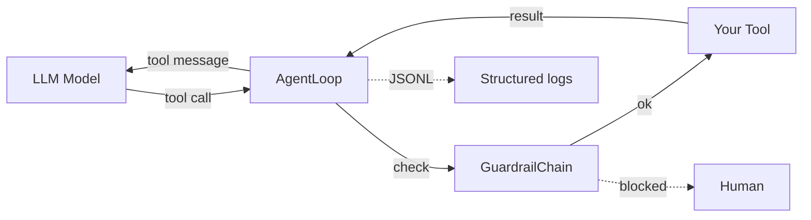
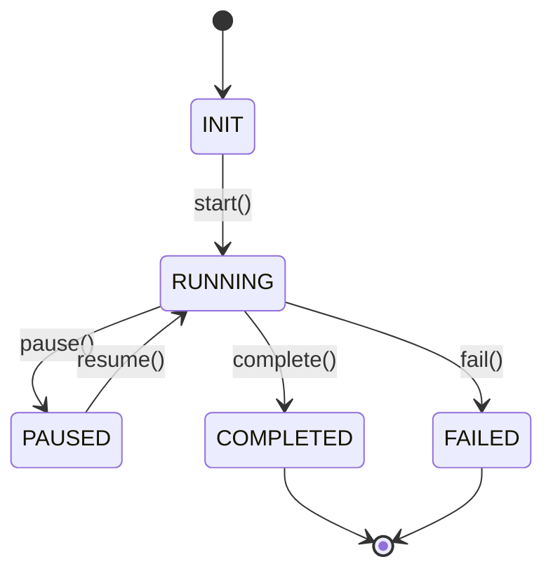

# Core concepts

pyarnes is a small library that sits *between* your AI coding agent and the tools it calls. It catches failures, enforces safety, and makes every step visible.

## The big picture

Each arrow is a place where pyarnes already handles the awkward bits so you do not have to.

## Six design principles

The library is small on purpose. Six rules explain every decision.

1. **Async-first** — all tool execution uses `asyncio` to avoid GIL contention. The `AgentLoop` dispatches tool calls as async operations. *(If you have never written async Python: it means the loop can wait on slow operations like LLM calls without freezing everything else. You do not need to understand asyncio internals to use pyarnes.)*

2. **Structured logging** — every event is emitted as JSONL on **stderr** via `loguru`. Stdout is reserved for tool results. See [Logging](../../reference/logging.md) for configuration.

3. **Error taxonomy** — four error types ensure failures are always routed correctly: retry, feed back, interrupt, or bubble up. See the [full error table](#four-error-types) below.

4. **Composable guardrails** — safety checks stack via `GuardrailChain`. Each guardrail is a simple `check(tool_name, arguments)` → raises `UserFixableError` or passes.

5. **Lifecycle FSM** — every session has a trackable state machine with full transition history.

6. **No magic** — there are no decorators, metaclasses, or auto-discovery. You register tools explicitly in a `ToolRegistry`, wire up guardrails, and run the loop.

## Four error types

When a tool fails, pyarnes classifies the failure into one of four categories and handles it appropriately — no custom error handling on your side.

| Error | When it fires | What pyarnes does |
|---|---|---|
| `TransientError` | Network timeout, rate limit, flaky API | Retries with exponential backoff (max 2 attempts) |
| `LLMRecoverableError` | Bad JSON, wrong tool args, semantic mistake | Feeds the error back to the model so it self-corrects |
| `UserFixableError` | Missing API key, permission denied | Interrupts the loop for human input |
| `UnexpectedError` | Bug in your tool code | Bubbles up for debugging |

Full routing diagram and field reference: [reference/errors.md](../../reference/errors.md).

## Session lifecycle

Every agent session is a tiny state machine. You can always ask "what phase is this session in?" and get a definite answer.

Full transition table and REST API: [reference/lifecycle.md](../../reference/lifecycle.md).

## Next step

Decide which **adopter shape** fits your project → [Distribution model](distribution.md).
