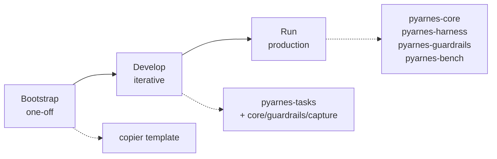

# Distribution model

**pyarnes is a library, not a CLI.** Adopters scaffold their project with `uvx copier copy gh:Cognitivemesh/pyarnes <dest>`, pull the five `pyarnes-*` packages as pinned git dependencies, and build their own Typer CLI on top. The only CLI pyarnes ships — `pyarnes-tasks` — is dev-infrastructure.

This page answers three questions new adopters always ask: **which packages do I import and when, what does pyarnes do for me at each phase, and what am I still on the hook for?**

## The three-phase model

| Phase | What happens | pyarnes packages involved |
|---|---|---|
| **Bootstrap** (one-off) | `uvx copier copy` scaffolds the project. `uv sync` pulls pyarnes via git URLs pinned to `pyarnes_ref`. | *copier template only* |
| **Develop** (iterative) | The coding agent (Claude Code / Cursor / Codex) consumes `pyarnes-tasks` via `uv run tasks …` to lint / typecheck / test. Adopter C additionally wires `pyarnes-core` / `pyarnes-guardrails` / `pyarnes-harness.capture` into Claude Code's pre/post-tool-use hooks. | `pyarnes-tasks` always; + `core` / `guardrails` / `harness.capture` for the meta-use pattern |
| **Run** (production) | The pipeline the adopter ships imports `AgentLoop`, composes a `GuardrailChain`, registers `ToolHandler` subclasses, and dispatches tools. | `pyarnes-core`, `pyarnes-harness`, `pyarnes-guardrails`, optionally `pyarnes-bench` |

The split matters because it keeps `pyarnes-harness` CLI-free (a 40-line Typer command in the adopter repo is strictly more expressive than a declarative config schema) and keeps `pyarnes-tasks` out of the runtime dependency graph (it doesn't belong in a container image).

## The three reference adopters

The pyarnes repo no longer ships in-tree example packages — three reference shapes are documented as specs in [`specs/`](https://github.com/Cognitivemesh/pyarnes/tree/main/specs). Each is selectable at scaffold time via the Copier `adopter_shape` question:

- **Adopter A — `pii-redaction`**: document ingest → text extraction → PII detection → redaction → markdown → TF-IDF keyword ranking. See [`specs/03-examples-adopter-a-and-b.md`](https://github.com/Cognitivemesh/pyarnes/blob/main/specs/03-examples-adopter-a-and-b.md).
- **Adopter B — `s3-sweep`**: list bucket → download all objects → verify checksum → **`delete_bucket` gated by `VerificationCompleteGuardrail`**. Same spec as Adopter A.
- **Adopter C — `rtm-toggl-agile`**: RTM tasks + Toggl time entries → normalised agile backend. Opts into the meta-use pattern (Claude Code hooks import the pyarnes surface to harness the coding agent itself). See [`specs/04-template-adopter-c-meta-use.md`](https://github.com/Cognitivemesh/pyarnes/blob/main/specs/04-template-adopter-c-meta-use.md).

A fourth `blank` shape stamps out a minimal scaffold without shape-specific stubs.

## What pyarnes gives you at runtime

| You want | pyarnes gives you |
|---|---|
| A loop that dispatches tool calls, routes errors, and retries transients | `AgentLoop` + `LoopConfig` |
| The ABC your tool handlers subclass | `ToolHandler` (in `pyarnes_core.types`) |
| A validated registry of tools | `ToolRegistry` |
| A four-way error taxonomy the loop already routes | `TransientError`, `LLMRecoverableError`, `UserFixableError`, `UnexpectedError` |
| Composable safety checks (path, command, allowlist) | `GuardrailChain` + built-in `Guardrail` subclasses |
| Stderr-JSONL structured logging | `get_logger`, `configure_logging` |
| An append-only audit trail of every tool call | `ToolCallLogger` |
| Scoring for evaluating pipeline quality | `EvalSuite`, `EvalResult`, `Scorer` |

Every symbol above is part of the **stable public surface** (see [`CHANGELOG.md`](https://github.com/Cognitivemesh/pyarnes/blob/main/CHANGELOG.md)). Adopters pinning `pyarnes_ref` to a tag can rely on these names to stay stable until the next MAJOR release.

## What you still own

- The `ModelClient` subclass bridging pyarnes to your LLM provider.
- Every `ToolHandler` subclass — the actual domain logic.
- The `GuardrailChain` composition — pyarnes does **not** auto-apply guardrails; call `chain.check(tool_name, args)` explicitly before each `tool.execute(args)`.
- The Typer CLI — `[project.scripts]` in your `pyproject.toml`.

## Next step

Ready to scaffold? → [Scaffold a project](../bootstrap/scaffold.md).
