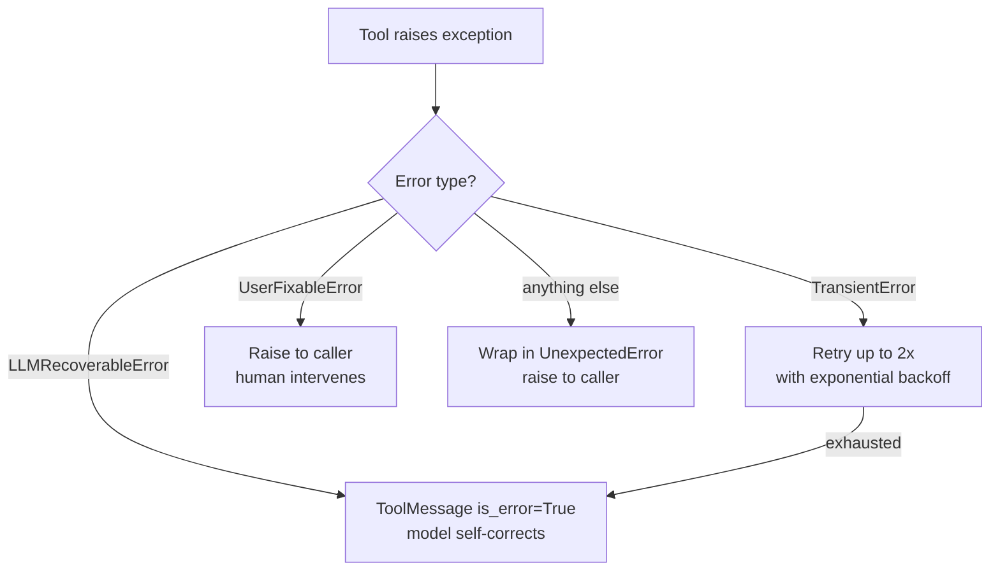

# Errors

**Module:** `pyarnes_core.errors`

## The problem

When an LLM-driven agent calls tools, failures happen constantly: network timeouts, malformed JSON, missing permissions, unexpected crashes. Treating all of them the same way (crash the loop) wastes work and frustrates you.

## The solution: four error types

pyarnes classifies every failure into exactly one of four categories. Each has a specific recovery strategy:

| Error | When to use | What happens |
|---|---|---|
| `TransientError` | Network timeout, rate limit, flaky API | Retry with exponential backoff (max 2 attempts) |
| `LLMRecoverableError` | Bad JSON schema, invalid tool args, semantic mistake | Feed the error back as a `ToolMessage(is_error=True)` so the model adjusts |
| `UserFixableError` | Missing API key, needs approval, permission denied | Interrupt the loop and surface to a human |
| `UnexpectedError` | Bug in tool code, assertion failure, unknown crash | Bubble up immediately for debugging |

## Routing through the agent loop



## Hierarchy

All errors inherit from `HarnessError`, a frozen dataclass that is also an `Exception`.

```python
from pyarnes_core.errors import HarnessError, Severity

err = HarnessError(
    message="Something went wrong",
    context={"tool": "read_file", "path": "/etc/passwd"},
    severity=Severity.HIGH,
)
```

## Examples

```python
from pyarnes_core.errors import TransientError, LLMRecoverableError, UserFixableError

# In a tool handler:
raise TransientError(message="API timeout", max_retries=3, retry_delay_seconds=2.0)

raise LLMRecoverableError(message="Expected JSON but got plain text", tool_call_id="call_abc")

raise UserFixableError(message="Missing OPENAI_API_KEY", prompt_hint="Set the OPENAI_API_KEY environment variable")
```

## Field reference

### HarnessError (base class)

::: pyarnes_core.errors.HarnessError

### TransientError

Retriable failures (network timeout, rate limit). The agent loop retries with exponential backoff.

::: pyarnes_core.errors.TransientError

### LLMRecoverableError

Errors the model can recover from. Converted into `ToolMessage(is_error=True)` and fed back.

::: pyarnes_core.errors.LLMRecoverableError

### UserFixableError

Requires human intervention. The loop raises this to the caller.

::: pyarnes_core.errors.UserFixableError

### UnexpectedError

Catch-all for bugs and unknown failures. Wraps the original exception.

::: pyarnes_core.errors.UnexpectedError

### Severity enum

::: pyarnes_core.errors.Severity
