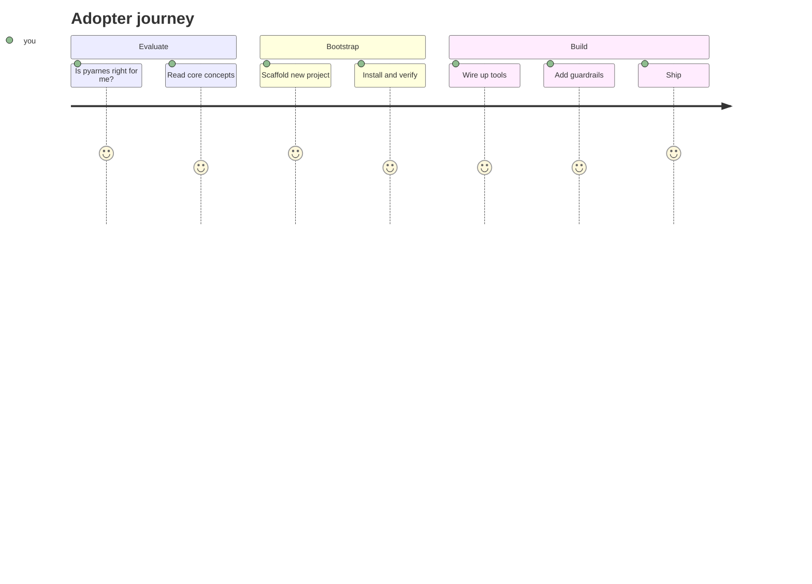

# Adopter journey

You are here to **use pyarnes as a template** for your own project. Pick your starting point based on where you are:

- :material-compass-outline:{ .lg .middle } **Evaluate**

    ---

    Understand what pyarnes gives you and decide if it fits your project.

    [:octicons-arrow-right-24: Core concepts](evaluate/concepts.md)

- :material-rocket-launch:{ .lg .middle } **Bootstrap**

    ---

    Scaffold a new project from the template in one command.

    [:octicons-arrow-right-24: Scaffold a project](bootstrap/scaffold.md)

- :material-wrench:{ .lg .middle } **Build**

    ---

    Wire up tools, add guardrails, and ship your agentic pipeline.

    [:octicons-arrow-right-24: Quick start](build/quickstart.md)

## How pyarnes collaborates with your AI coding CLI

pyarnes does **not** replace Claude Code, Codex, Cursor, Gemini, or Aider — it collaborates with them. The scaffolded template produces:

- An `AGENTS.md` file read by every CLI that supports the shared convention. This is the **source of truth** for project rules.
- A Claude-Code-specific `CLAUDE.md` that defers to `AGENTS.md` and adds CC-only guidance.
- When you opt into `enable_dev_hooks`, a `.claude/settings.json` that wires five hook scripts into Claude Code:

| Hook | What it does |
|---|---|
| `PreToolUse` | Runs `GuardrailChain` (`PathGuardrail`, `CommandGuardrail`, `SecretLeakGuardrail`, `NetworkEgressGuardrail`, `RateLimitGuardrail`, `ToolAllowlistGuardrail`). Blocks the tool call when any guardrail raises `UserFixableError`. |
| `PostToolUse` | Audit-logs the call, scans `tool_response` for secrets (detect-and-halt — CC cannot redact the response), increments the `Budget`. |
| `Stop` | Emits `{"continue": false}` when a `Budget` cap has been hit — the only mechanism Claude Code offers to force a session end. |
| `SessionStart` / `SessionEnd` | Load / dump the `Lifecycle` checkpoint at `$CLAUDE_PROJECT_DIR/.claude/pyarnes/checkpoint-<session>.json`. |

When you later want to *grade* a Claude Code session post-hoc, `pyarnes_harness.read_cc_session` parses the transcript into `ToolCallEntry` records — the same shape bench scorers consume for in-process `AgentLoop` runs.

## New to Python?

You do not need to be a Python expert. pyarnes hides most of the async / dataclass / ABC complexity behind simple contracts. Every adopter page opens with a diagram or a table before any code, and explains Python jargon the first time it appears.

## Need the API details?

Public-API signatures live alongside their owning package under [Maintainer › Packages](../maintainer/packages/core.md). Adopter-facing concepts (error taxonomy, lifecycle FSM, logging) live in [Evaluate](evaluate/errors.md).
