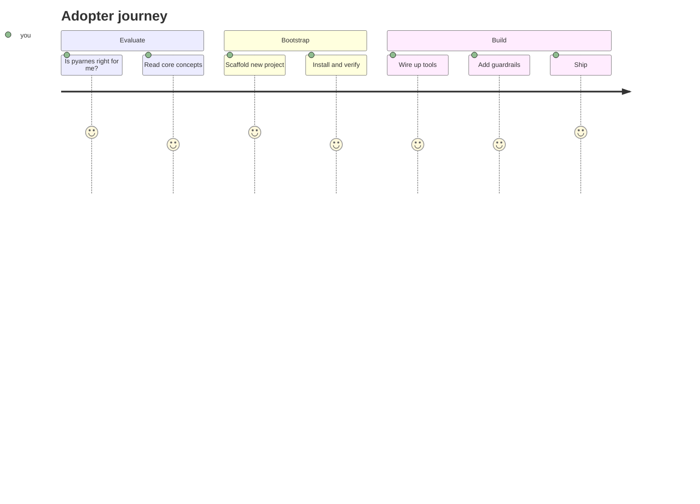

# Adopter journey

You are here to **use pyarnes as a template** for your own project. Pick your starting point based on where you are:

- :material-compass-outline:{ .lg .middle } **Evaluate**

    ---

    Understand what pyarnes gives you and decide if it fits your project.

    [:octicons-arrow-right-24: Core concepts](evaluate/concepts.md)

- :material-rocket-launch:{ .lg .middle } **Bootstrap**

    ---

    Scaffold a new project from the template in one command.

    [:octicons-arrow-right-24: Scaffold a project](bootstrap/scaffold.md)

- :material-wrench:{ .lg .middle } **Build**

    ---

    Wire up tools, add guardrails, and ship your agentic pipeline.

    [:octicons-arrow-right-24: Quick start](build/quickstart.md)

## New to Python?

You do not need to be a Python expert. pyarnes hides most of the async / dataclass / ABC complexity behind simple contracts. Every adopter page opens with a diagram or a table before any code, and explains Python jargon the first time it appears.

## Need the API details?

Public-API signatures live alongside their owning package under [Maintainer › Packages](../maintainer/packages/core.md). Adopter-facing concepts (error taxonomy, lifecycle FSM, logging) live in [Evaluate](evaluate/errors.md).
