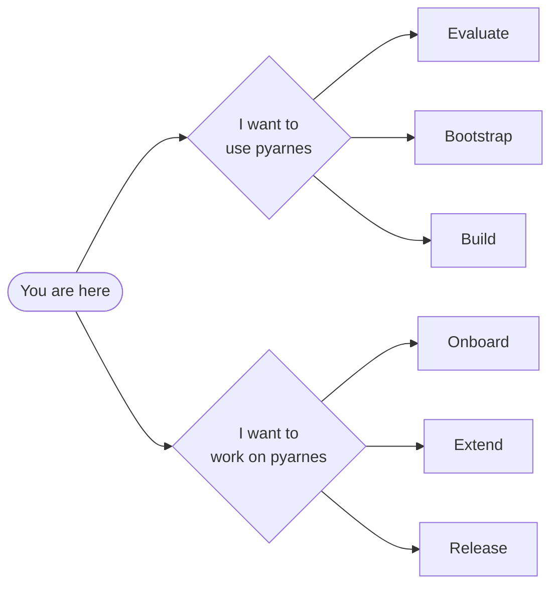

# pyarnes

> A minimal agentic harness engineering template for Python.

**pyarnes** adds verification loops, safety enforcement, and lifecycle management that AI coding tools miss. It captures raw outputs and errors, feeds that reality back to the model, applies guardrails around what the system can touch, and makes every step visible and debuggable.

## Pick your path

- :material-package-variant:{ .lg .middle } **Adopter** &nbsp;{ .badge-adopter }

    ---

    Scaffold a new project that depends on pyarnes via git URLs. Build your own agent on top.

    [:octicons-arrow-right-24: Start the adopter journey](adopter/index.md){ .md-button .md-button--primary }

- :material-tools:{ .lg .middle } **Maintainer** &nbsp;{ .badge-maintainer }

    ---

    Contribute to pyarnes itself — packages, template, releases.

    [:octicons-arrow-right-24: Start the maintainer journey](maintainer/index.md){ .md-button }

## What problem does it solve?

AI coding agents (Claude Code, Cursor, Codex) generate tool calls but have no built-in system for:

- **Retrying flaky operations** — network timeouts, rate limits
- **Feeding errors back** — so the model can self-correct instead of crashing
- **Enforcing safety limits** — blocking `rm -rf /` or access outside `/workspace`
- **Tracking session state** — knowing if the agent is running, paused, or done
- **Logging everything** — structured JSONL that humans and machines can parse

pyarnes solves all of these with a single `AgentLoop` + guardrails + lifecycle FSM.

## Key features

| Feature | What it does |
|---|---|
| **Error taxonomy** | Routes failures through 4 types: retry, feedback, interrupt, or bubble up |
| **Agent loop** | Async loop that dispatches LLM tool calls with full error handling |
| **Guardrails** | Composable checks: path allowlists, command blocklists, tool allowlists |
| **Lifecycle FSM** | INIT → RUNNING → PAUSED → COMPLETED / FAILED with history |
| **JSONL logging** | Every event logged as structured JSON to stderr via loguru |
| **Eval framework** | Score agent outputs with pluggable scorers (exact match, custom) |

## Three journeys per persona

| Persona | Journey | Starts at |
|---|---|---|
| **Adopter** | Evaluate | [Core concepts](adopter/evaluate/concepts.md) |
| **Adopter** | Bootstrap | [Scaffold a project](adopter/bootstrap/scaffold.md) |
| **Adopter** | Build | [Quick start](adopter/build/quickstart.md) |
| **Maintainer** | Onboard | [Dev setup](maintainer/onboard/setup.md) |
| **Maintainer** | Extend | [Architecture & meta-use](maintainer/extend/architecture.md) |
| **Maintainer** | Release | [Release workflow](maintainer/release.md) |

## Reference

All public symbols live under [Reference](reference/types.md) — the stable API surface both adopters and maintainers rely on.
