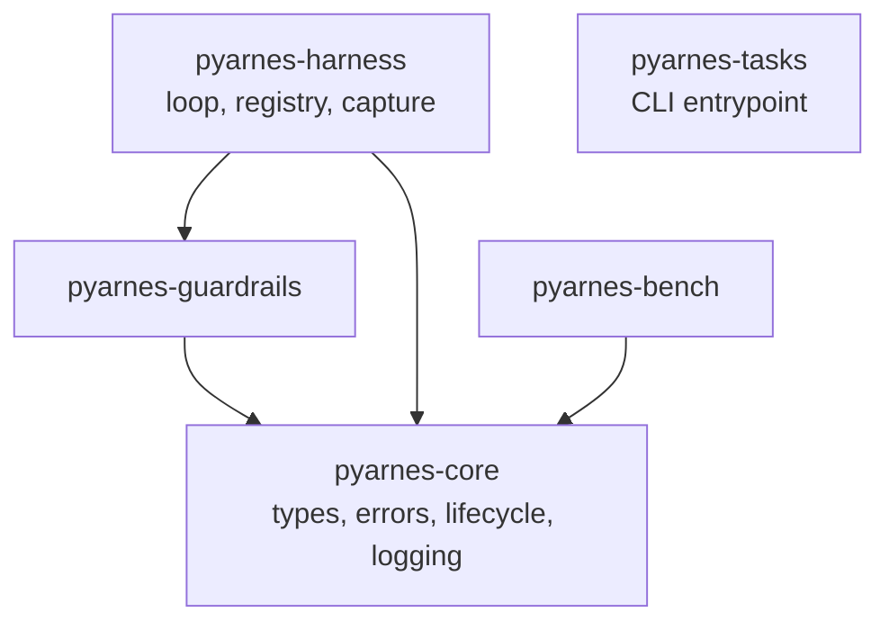

# Architecture & meta-use

## Monorepo layout

pyarnes is a **uv workspace monorepo**. Each package has its own `pyproject.toml` and can be installed independently.

```text
pyarnes/
├── packages/
│   ├── core/         → pyarnes-core       (types, errors, lifecycle, logging)
│   ├── harness/      → pyarnes-harness    (loop, tools, capture)
│   ├── guardrails/   → pyarnes-guardrails (safety checks)
│   ├── bench/        → pyarnes-bench      (evaluation framework)
│   └── tasks/        → pyarnes-tasks      (cross-platform task runner)
├── template/         → Copier template scaffolded into new projects
├── copier.yml        → Prompts for `uvx copier copy gh:Cognitivemesh/pyarnes`
└── tests/
    ├── unit/         → unit tests for all packages
    └── features/     → BDD / Gherkin acceptance tests
```

## Package graph



`pyarnes-core` is the foundation — every other package depends on it for error types and logging. `pyarnes-tasks` is dev-infrastructure; it's excluded from the runtime dep graph.

## Cross-cutting design principles

Rules that hold across every package. Each `maintainer/packages/<name>.md` only calls out package-specific reasons to exist; these repo-wide rules live here.

- **Async-first.** Tool execution uses `asyncio` so I/O-bound work doesn't block the loop. `ToolHandler.execute()` is `async`; the loop awaits it.
- **JSONL on stderr.** All structured events go to stderr as one JSON object per line. Stdout is reserved for tool output that the LLM reads. `loguru` is the sole runtime logging dep.
- **No CLI in runtime packages.** A Typer/argparse entry point in the adopter's own `main.py` is strictly more expressive than a declarative CLI shipped here. The one exception is `pyarnes-tasks`, which is dev-infrastructure.
- **Errors are orthogonal to the loop.** Classification lives in `pyarnes-core`; `pyarnes-harness` is the only consumer that enforces the routing (retry / feedback / interrupt / bubble).
- **Stable API is frozen-dataclass shaped.** Public records are frozen dataclasses (`HarnessError`, `EvalResult`, `CapturedOutput`, `ToolMessage`). Callers can rely on value semantics; mutation is not part of the contract.
- **No magic.** No decorators that auto-register, no metaclasses, no import-time side effects. Adopters explicitly build a `ToolRegistry`, compose a `GuardrailChain`, and pass them to `AgentLoop`.

## Repo layout

```text
pyarnes/
├── copier.yml                  # Template prompts (project_name, …, pyarnes_ref)
├── template/                   # Copier template tree rendered into new projects
│   ├── pyproject.toml.jinja    # 5 git-URL deps, no workspace config
│   ├── src/{{project_module}}/__init__.py.jinja
│   ├── CLAUDE.md.jinja  README.md.jinja  LICENSE.jinja  mkdocs.yml.jinja
│   ├── .claude/skills/python-test/SKILL.md
│   └── docs/…
├── packages/                   # uv-workspace packages (the dependencies)
├── tests/                      # Unit + BDD/Gherkin tests for the packages
├── docs/                       # MkDocs Material documentation source
├── specs/                      # Feature specifications (monorepo-internal, excluded from template)
└── pyproject.toml              # Root workspace (no buildable wheel, dev deps only)
```

Each workspace package has its own `pyproject.toml`. The root `pyproject.toml` declares the uv workspace, the shared tool configuration (ruff, ty, pytest, bandit, coverage, pylint, pymarkdown, yamllint), and the `[tool.pyarnes-tasks]` block that drives the `tasks` CLI.

## Meta-use — pyarnes harnessing the coding agent

The `rtm-toggl-agile` template shape opts into a pattern the other shapes do not: **pyarnes is imported twice**. Once by the shipped product (same as the `pii-redaction` and `s3-sweep` shapes), and once by the Copier-generated Claude Code hooks that run *around* the coding agent as it edits the project.

Same packages, two consumption patterns, one library.

### Anatomy of the dev-time harness

| Requirement | pyarnes surface used | How it's wired |
|---|---|---|
| Track what the coding agent did | `get_logger`, `configure_logging`, `LogFormat` | `.claude/hooks/pyarnes_pre_tool.py` calls `get_logger("coding_agent.pre_tool")`; output lands in `.pyarnes/dev.jsonl`. |
| Gate what the coding agent tries | `GuardrailChain`, `PathGuardrail`, `CommandGuardrail`, `ToolAllowlistGuardrail` | Pre-tool-use hook composes a chain and calls `chain.check(tool, args)`. Violations exit with code 2 + a `{"decision": "block", "reason": …}` payload. |
| Audit trail of every tool call | `ToolCallLogger` (top-level `pyarnes_harness`) | Post-tool-use hook appends one JSONL record per call to `.pyarnes/agent_tool_calls.jsonl`. |
| Score the coding agent | `EvalSuite`, `EvalResult`, `Scorer`, `ExactMatchScorer` | `tests/bench/test_agent_quality.py` loads labeled scenarios, runs the coding agent, collects scores into an `EvalSuite`, asserts minimum pass rate. |

### The shipped hooks (from the template)

#### Pre-tool-use — `.claude/hooks/pyarnes_pre_tool.py`

```python
configure_logging(fmt=LogFormat.JSON, level="INFO")
log = get_logger("coding_agent.pre_tool")

CHAIN = GuardrailChain(guardrails=[
    PathGuardrail(
        allowed_roots=("{{ repo_root }}",),
        path_keys=("path", "file_path", "directory", "target"),
    ),
    CommandGuardrail(),
    ToolAllowlistGuardrail(allowed_tools=frozenset({
        "Read", "Write", "Edit", "Glob", "Grep", "Bash", "TodoWrite",
    })),
])

event = json.load(sys.stdin)
try:
    CHAIN.check(event["tool_name"], event.get("tool_input", {}))
except UserFixableError as exc:
    print(json.dumps({"decision": "block", "reason": str(exc)}))
    sys.exit(2)
```

#### Post-tool-use — `.claude/hooks/pyarnes_post_tool.py`

```python
logger = ToolCallLogger(path=Path(".pyarnes/agent_tool_calls.jsonl"))
event = json.load(sys.stdin)
logger.log_call(
    event["tool_name"], event.get("tool_input", {}),
    result=str(event.get("tool_response", "")),
    is_error=bool(event.get("is_error", False)),
    started_at=..., finished_at=..., duration_seconds=...,
)
```

Both files live under [`template/.claude/hooks/`](https://github.com/Cognitivemesh/pyarnes/tree/main/template/.claude/hooks) and ship only when the adopter answers `enable_dev_hooks: true` at scaffold time (default when `adopter_shape=rtm-toggl-agile`, off otherwise).

### `.pyarnes/` directory layout

```text
.pyarnes/
├── dev.jsonl                # structured logs from coding_agent.* loggers
├── agent_tool_calls.jsonl   # ToolCallLogger audit trail
└── .gitignore               # "*.jsonl" — audit logs don't land in git
```

The JSONL schema mirrors what the shipped runtime writes — so a single `jq` invocation can inspect both streams.

### Why the same library for both sides

- **One surface to learn.** The contributors writing the shipped pipeline and the ones tightening the dev-time guardrails read the same docs and import from the same modules.
- **Guardrails tested against themselves.** A bug in `CommandGuardrail` surfaces both in the shipped pipeline and in the coding agent's session — twice the chances of catching it.
- **No extra build.** The Copier template just stamps the hooks out of the same git-pinned `pyarnes_ref`; no PyPI release, no wheel drift.

### Extending the pattern

- Add a custom `Guardrail` subclass under your project's `guardrails.py` and import it into the hook. It obeys the same `check(tool, args)` contract — no hook-specific shim needed.
- Add a custom `Scorer` under `tests/bench/` for domain-specific agent evaluation. Plug it into the `EvalSuite` in `test_agent_quality.py`.
- Route `.pyarnes/dev.jsonl` to your observability stack by configuring loguru sinks in the pre-tool hook's preamble.

The canonical wiring for this pattern lives in the Copier template under [`template/.claude/hooks/`](https://github.com/Cognitivemesh/pyarnes/tree/main/template/.claude/hooks) and is stamped into every generated project that sets `enable_dev_hooks: true`.

## See also

- [Extension rules](rules.md) — what must go where when adding new surfaces.
- [Evolving workflow](workflow.md) — full contributor walkthrough.
- [Error taxonomy](../../adopter/evaluate/errors.md) and [Lifecycle](../../adopter/evaluate/lifecycle.md) (shared with adopters).
