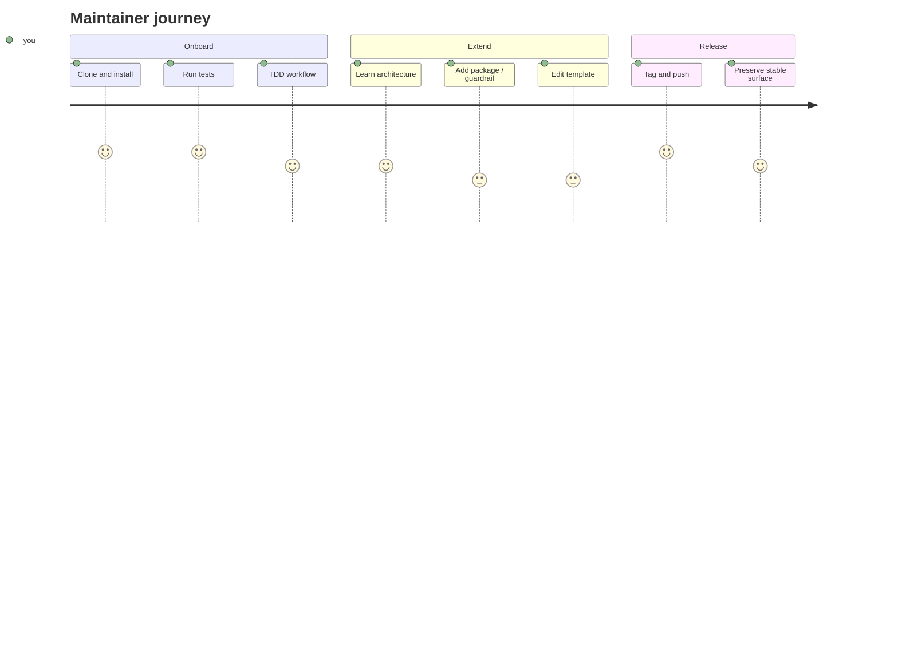

# Maintainer journey

You are here to **contribute to pyarnes itself**. Three journeys, from first PR to cutting releases:

*Scores reflect perceived ease — higher is smoother.*

- :material-account-plus:{ .lg .middle } **Onboard**

    ---

    Set up the dev environment, learn the repo, run tests.

    [:octicons-arrow-right-24: Dev setup](onboard/setup.md)

- :material-puzzle:{ .lg .middle } **Extend**

    ---

    Add packages, guardrails, scorers, or template questions.

    [:octicons-arrow-right-24: Architecture & meta-use](extend/architecture.md)

- :material-tag:{ .lg .middle } **Release**

    ---

    Cut a release and preserve the stable public surface.

    [:octicons-arrow-right-24: Release workflow](release.md)

## Cross-links

- Adopter-side docs explain what your changes look like from the outside — start at [the adopter journey](../adopter/index.md).
- Per-package deep-dives with absorbed Public API live under [Packages](packages/core.md) — start with `pyarnes-core` and follow the dep graph.
