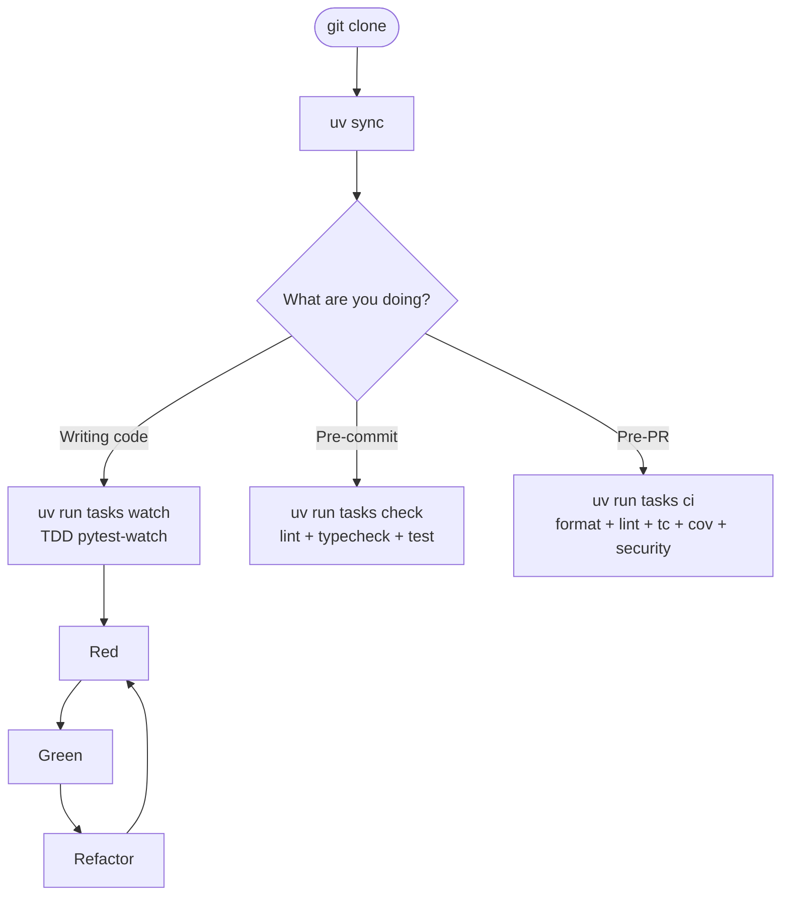

# Dev setup

This page is for contributors and maintainers of **pyarnes itself** — people working on the five `pyarnes-*` packages and the template shipped inside this repo. If you just want to use pyarnes as a starting point for your own project, see [Scaffold a project](../../adopter/bootstrap/scaffold.md) instead.

## Daily workflow



## Prerequisites

- **Python 3.13+** — pyarnes uses modern Python features (slots, frozen dataclasses, match statements)
- **[uv](https://github.com/astral-sh/uv)** — fast Python package manager with workspace support

## Install from source

```bash
git clone https://github.com/Cognitivemesh/pyarnes.git
cd pyarnes
uv sync
```

This installs all five workspace packages and their dev dependencies.

## Daily commands

```bash
uv sync                   # install all workspace packages + dev deps
uv run tasks help         # list available tasks
uv run tasks watch        # TDD watch mode (pytest-watch)
uv run tasks check        # lint + typecheck + test
uv run tasks ci           # format:check + lint + typecheck + test:cov + security
```

The TDD discipline is Red → Green → Refactor — see [`.claude/commands/tdd.md`](https://github.com/Cognitivemesh/pyarnes/blob/main/.claude/commands/tdd.md) for the exact cycle.

## Making a change inside a package

1. Work inside `packages/<pkg>/src/pyarnes_<pkg>/`.
2. Write the failing test in `tests/unit/test_<module>.py` or `tests/features/<feature>.feature`.
3. Run `uv run tasks watch` in another terminal to see it turn red → green.
4. Run `uv run tasks check` before committing.

## Known constraints

- Python 3.13+ only. The template pins `>=3.13` and pyarnes's own code uses 3.13 features (match statements, frozen slotted dataclasses).
- uv required. All workflows are expressed as `uv run tasks …`; no Make, no shell scripts beyond `scripts/`.
- Generated projects cannot use pyarnes offline on first sync — the git URLs need one-time clone access. uv caches the result for subsequent installs.

## Verify

```bash
uv run tasks check
```

You should see all tests pass:

```text
Results (0.6s):
    90 passed
```

## Next step

Write or extend tests → [Testing & TDD](testing.md).
