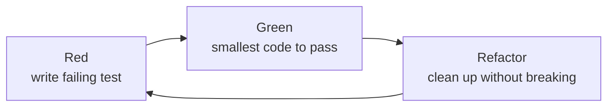

# Testing & TDD

## Red → Green → Refactor



Every change follows this cycle. Never commit a refactor without a green test suite first.

## Run tests

```bash
uv run tasks test          # run all tests
uv run tasks test:cov      # with coverage
uv run tasks watch         # TDD watch mode
```

## Test structure

```text
tests/
├── conftest.py                      # shared fixtures (logging config)
├── unit/                            # unit tests
│   ├── test_capture.py              # OutputCapture / CapturedOutput
│   ├── test_errors.py               # four-error taxonomy
│   ├── test_guardrails.py           # path, command, tool-allowlist guardrails
│   ├── test_integration.py          # cross-package integration tests
│   ├── test_lifecycle.py            # lifecycle FSM transitions
│   ├── test_logger.py               # JSONL and console logging
│   ├── test_loop.py                 # AgentLoop error routing
│   ├── test_registry.py             # ToolRegistry CRUD
│   ├── test_stable_surface.py       # public-API import checks
│   ├── test_tasks.py                # tasks runner
│   ├── test_tasks_cli.py            # tasks CLI entry point
│   └── test_tool_log.py             # JSONL tool-call logger
└── features/                        # BDD / Gherkin acceptance tests
    ├── harness.feature              # error-handling scenarios
    ├── acceptance.feature           # user acceptance test scenarios
    └── steps/
        ├── test_harness_steps.py    # step implementations
        └── test_acceptance_steps.py # acceptance test steps
```

## Unit tests

Unit tests use `pytest` and import directly from the workspace packages:

```python
from pyarnes_core.errors import TransientError
from pyarnes_harness.loop import AgentLoop, LoopConfig
from pyarnes_guardrails import PathGuardrail
```

## BDD / Gherkin acceptance tests

Feature files in `tests/features/` use `pytest-bdd` to express user-facing scenarios in plain English:

```gherkin
Feature: Agent harness error handling
  Scenario: Transient error triggers retry
    Given a tool that raises a transient error
    When the harness executes the tool
    Then the tool is retried up to the configured limit
    And the error is returned as a tool message
```

Step definitions are in `tests/features/steps/`.

## Testing libraries

| Library | Purpose |
|---|---|
| **pytest** | Test framework |
| **pytest-bdd** | Gherkin BDD scenarios |
| **pytest-asyncio** | Async test support |
| **pytest-cov** | Coverage reporting |
| **pytest-sugar** | Pretty test output |
| **hypothesis** | Property-based testing |
