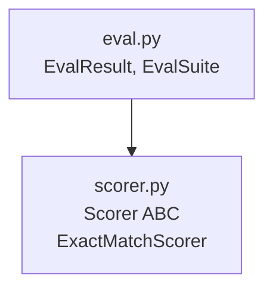
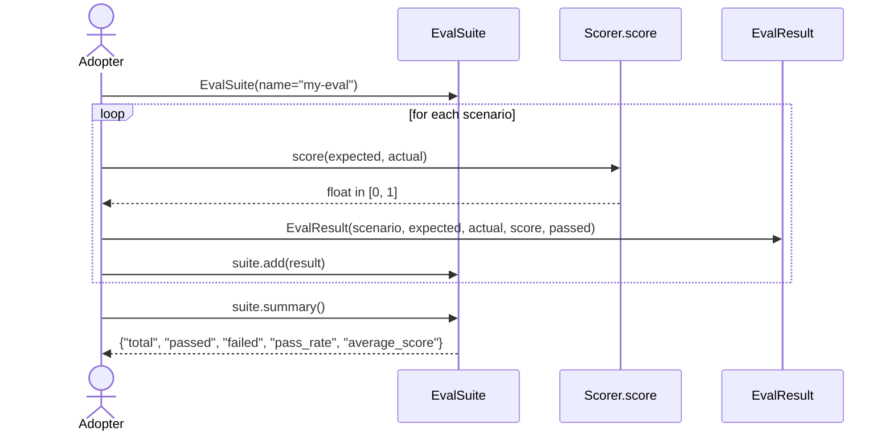
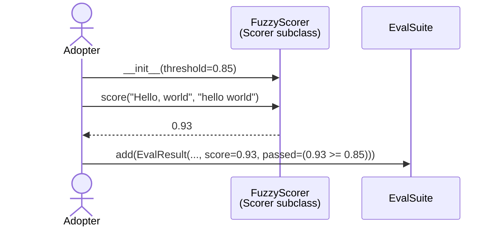

# pyarnes-bench

Lightweight evaluation and benchmarking toolkit. Score agent outputs, aggregate pass rates, plug in custom scorers. Depends only on `pyarnes-core` for logging.

## Module layout

Inter-package deps live in [Architecture § Package graph](../extend/architecture.md#package-graph). Internal layout:



| Module | Role |
|---|---|
| `eval.py` | `EvalResult` (immutable record) + `EvalSuite` (collects, runs, summarises batches). |
| `scorer.py` | `Scorer` ABC with `score(expected, actual) -> float` + `ExactMatchScorer` built-in. |

## Why this package exists

Repo-wide rules live in [Architecture § Cross-cutting design principles](../extend/architecture.md#cross-cutting-design-principles). Package-specific reasons:

- **Adopter evaluation, not library benchmarks.** This package exists so adopters can measure whether their agent pipeline actually works — not for benchmarking pyarnes itself.
- **Scorer is pluggable.** Exact-match is the 80 % case; fuzzy scorers, LLM-judge scorers, and domain-specific scorers are all adopter responsibilities. The ABC keeps them swap-in.
- **Zero dep surface.** Only depends on `pyarnes-core`. No test framework, no HTTP, no reporters — stays a library, not a framework.

## Key flows

### Eval run



### Custom scorer authoring



The `Scorer` ABC doesn't dictate passing rules — the caller decides. Common pattern: a threshold kept on the scorer, a `passed=score >= threshold` check at record time.

## Public API

### EvalResult

Immutable record of a single evaluation. Fields:

| Field | Type | Description |
|---|---|---|
| `scenario` | `str` | Scenario identifier |
| `expected` | `Any` | Expected value |
| `actual` | `Any` | Actual value |
| `score` | `float` | Scorer output, typically in `[0, 1]` |
| `passed` | `bool` | Caller-defined pass/fail |

### EvalSuite

Collect and summarise `EvalResult` batches.

```python
from pyarnes_bench import EvalSuite, EvalResult

suite = EvalSuite(name="my-eval")
suite.add(EvalResult(scenario="greeting", expected="Hello", actual="hello", score=1.0, passed=True))
suite.summary()
# {"suite": "my-eval", "total": 1, "passed": 1, "failed": 0, "pass_rate": 1.0, "average_score": 1.0}
```

| Method | Description |
|---|---|
| `add(result)` | Append an `EvalResult` |
| `summary()` | Aggregate stats dict |
| `results` | Iterable of all stored results |

### Scorer ABC

```python
from pyarnes_bench import Scorer

class FuzzyScorer(Scorer):
    def score(self, expected, actual) -> float:
        ...
```

### ExactMatchScorer

```python
from pyarnes_bench import ExactMatchScorer

scorer = ExactMatchScorer(case_sensitive=False)
scorer.score("Hello", "hello")  # 1.0
scorer.score("Hello", "World")  # 0.0
```

| Field | Default | Description |
|---|---|---|
| `case_sensitive` | `True` | Comparison case-sensitivity |

## Extension points

- **Custom scorer:** subclass `Scorer`, implement `score(expected, actual) -> float`. That's it — no registration needed.
- **Composite scorer:** hold a list of `Scorer` instances, delegate, return max/mean — this lives in adopter code, not in pyarnes-bench.
- **Persistent results:** subclass `EvalSuite` to flush on `add()` or implement your own loader — keep the core `EvalSuite` in-memory only.

## Hazards / stable surface

- `EvalResult`, `EvalSuite`, `Scorer`, `ExactMatchScorer` (`pyarnes_bench`) — stable API, renames breaking.
- `EvalSuite.summary()` keys (`total`, `passed`, `failed`, `pass_rate`, `average_score`) — downstream scripts parse by name. Add keys freely; never rename or remove.
- The meta-use pattern (`tests/bench/test_agent_quality.py` in adopter projects) plugs domain scorers into `EvalSuite` — keep `add()` cheap and re-entrant.

## See also

- [Extension rules](../extend/rules.md) — custom scorer placement; no CLI here.
- [Architecture & meta-use](../extend/architecture.md) — how `EvalSuite` gates the coding agent in the dev-time harness.
- [pyarnes-core](core.md) — logger the suite writes transitions to.
