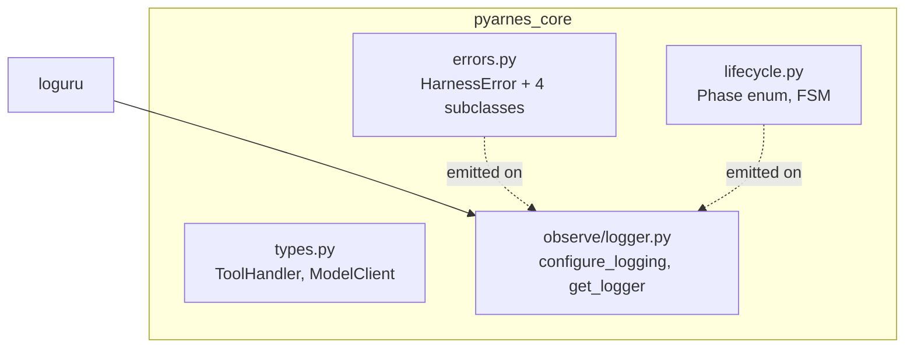
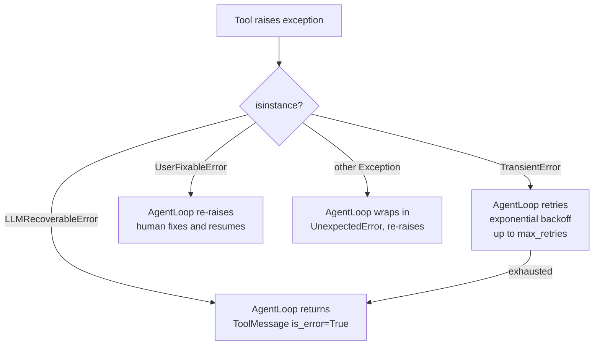
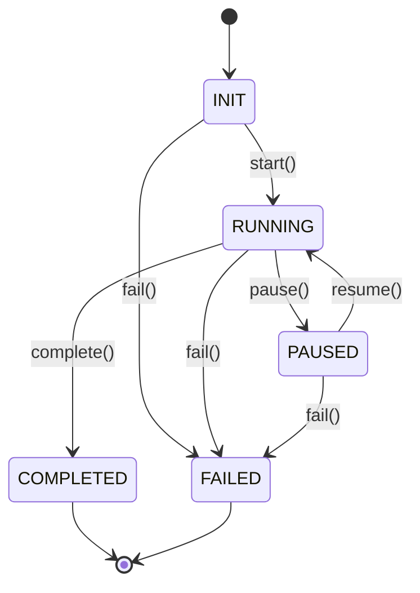

# pyarnes-core

The foundation package. Every other pyarnes package depends on it for types, errors, lifecycle, and logging. Runtime dependency: **only `loguru`**.

## Module layout



| Module | Role |
|---|---|
| `types.py` | Two ABCs: `ToolHandler` (async `execute`) and `ModelClient` (async `next_action`). The contract every adopter implements. |
| `errors.py` | `HarnessError` frozen-dataclass base + `TransientError`, `LLMRecoverableError`, `UserFixableError`, `UnexpectedError` plus `Severity` enum. |
| `lifecycle.py` | `Phase` enum + `Lifecycle` FSM with history, terminal detection, and transition logging. |
| `observe/logger.py` | `configure_logging(fmt, level, stream)` + `get_logger(name)` + `LogFormat` enum. Loguru is bound once here. |

## Why this package exists

- **Foundation only.** Every piece that ships with pyarnes eventually imports from here, so it must stay thin, typed, and free of heavy dependencies.
- **`loguru` is the sole runtime dep.** JSONL goes to stderr by design; stdout is reserved for tool output that the LLM reads. No stdlib `logging` — loguru wins on call-site ergonomics and structured sinks.
- **Error taxonomy lives here, not in harness.** Error classification is orthogonal to the loop. Placing it in core lets guardrails, bench, and adopter code raise the same symbols the loop knows how to route.
- **`Lifecycle` is a state machine, not a mixin.** Keeping it as an explicit object means transitions can be asserted, logged, and exposed over HTTP without smearing session state across the codebase.

## Key flows

### Error routing



The loop in `pyarnes-harness` is the only consumer that enforces this routing — `pyarnes-core` just defines the shapes.

### Lifecycle transition



Each transition writes a structured event via `get_logger("pyarnes_core.lifecycle")` and appends to `Lifecycle.history`. Invalid transitions raise `ValueError` — the FSM refuses silently-wrong state.

## Public API

### ToolHandler

Abstract base class for every tool the harness can invoke. You subclass this and implement `execute()`.

```python
from pyarnes_core.types import ToolHandler

class ReadFileTool(ToolHandler):
    async def execute(self, arguments: dict[str, Any]) -> Any:
        return open(arguments["path"]).read()
```

**Method:** `async execute(arguments: dict[str, Any]) -> Any`

- `arguments` — key-value arguments from the LLM's tool call
- Returns the tool's result (gets stringified for the model)

### ModelClient

Abstract base class for the backing LLM client. Controls what the agent does next.

```python
from pyarnes_core.types import ModelClient

class MyModel(ModelClient):
    async def next_action(self, messages: list[dict[str, Any]]) -> dict[str, Any]:
        # Return one of:
        # {"type": "tool_call", "tool": "name", "id": "call_1", "arguments": {...}}
        # {"type": "final_answer", "content": "..."}
        ...
```

**Method:** `async next_action(messages: list[dict[str, Any]]) -> dict[str, Any]`

- `messages` — full conversation history so far
- Returns a dict describing either a tool call or a final answer

### HarnessError (base)

Frozen dataclass, also an `Exception`.

| Field | Type | Default | Description |
|---|---|---|---|
| `message` | `str` | *(required)* | Human-readable error description |
| `context` | `dict[str, Any]` | `{}` | Arbitrary metadata |
| `severity` | `Severity` | `MEDIUM` | LOW, MEDIUM, HIGH, CRITICAL |

### TransientError

Retriable (network timeout, rate limit). `AgentLoop` retries with exponential backoff.

| Field | Type | Default |
|---|---|---|
| `max_retries` | `int` | `2` |
| `retry_delay_seconds` | `float` | `1.0` |

### LLMRecoverableError

The model can recover. Converted into `ToolMessage(is_error=True)` and fed back.

| Field | Type | Default |
|---|---|---|
| `tool_call_id` | `str \| None` | `None` |

### UserFixableError

Requires human intervention. The loop re-raises to the caller.

| Field | Type | Default |
|---|---|---|
| `prompt_hint` | `str` | `""` |

### UnexpectedError

Catch-all for bugs. Wraps the original exception.

| Field | Type | Default |
|---|---|---|
| `original` | `BaseException \| None` | `None` |
| `severity` | `Severity` | `CRITICAL` |

### Severity enum

`LOW`, `MEDIUM`, `HIGH`, `CRITICAL`.

### Phase enum

`INIT`, `RUNNING`, `PAUSED`, `COMPLETED`, `FAILED`.

### Lifecycle methods

| Method | Effect |
|---|---|
| `start()` | → RUNNING |
| `pause()` | → PAUSED |
| `resume()` | → RUNNING (from PAUSED) |
| `complete()` | → COMPLETED |
| `fail()` | → FAILED |
| `transition(target)` | Direct transition (validates) |

Plus: `phase` (current), `is_terminal`, `history` (list of transition dicts).

### Logging

```python
from pyarnes_core.observe.logger import configure_logging, get_logger, LogFormat

configure_logging(fmt=LogFormat.JSON, level="INFO")  # JSONL → stderr
# or
configure_logging(fmt=LogFormat.CONSOLE, level="DEBUG")  # coloured → stderr

logger = get_logger(__name__)
logger.info("event.name key=val", key="val")
```

Logger is a bound loguru logger. Sinks: stderr by default, pass `stream=` for custom.

## Extension points

- **New tool handlers:** subclass `ToolHandler`, keep `execute()` async, return any JSON-serialisable value. Register via `ToolRegistry` from `pyarnes-harness`.
- **New error subclass:** inherit from `HarnessError`. The loop routes by `isinstance`, so any new class falls into the `UnexpectedError` branch unless it derives from one of the four.
- **New log sink:** `configure_logging(stream=…)` — any `io.TextIOBase` works. For multi-sink setups, call `loguru.logger.add(...)` directly after `configure_logging`.

## Hazards / stable surface

These identifiers are part of the stable public API — renaming any of them is a breaking change:

- `ToolHandler`, `ModelClient` (`pyarnes_core.types`)
- `HarnessError`, `TransientError`, `LLMRecoverableError`, `UserFixableError`, `UnexpectedError`, `Severity` (`pyarnes_core.errors`)
- `Phase`, `Lifecycle` (`pyarnes_core.lifecycle`)
- `configure_logging`, `get_logger`, `LogFormat` (`pyarnes_core.observe.logger`)

Changing the signature of `ToolHandler.execute` or `ModelClient.next_action` ripples through every adopter project. Signature tests in `tests/unit/test_stable_surface.py` guard these — run them locally before opening a PR.

## See also

- [Extension rules](../extend/rules.md) — what must go where when adding new surfaces.
- [Architecture & meta-use](../extend/architecture.md) — monorepo package graph and dev-time harness pattern.
- [pyarnes-harness](harness.md) — the runtime that consumes this surface.
