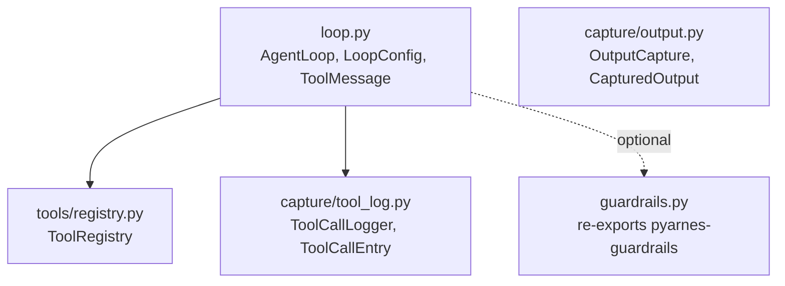

# pyarnes-harness

The runtime engine that drives agent execution — the async loop, the tool registry, output capture, and the JSONL audit logger. Depends on `pyarnes-core` for types/errors/lifecycle and re-exports `pyarnes-guardrails` for convenience.

## Module layout

Inter-package deps live in [Architecture § Package graph](../extend/architecture.md#package-graph). Internal layout:



| Module | Role |
|---|---|
| `loop.py` | `AgentLoop` — async loop that asks the model, dispatches tools, routes errors, returns messages. `LoopConfig` tunables. `ToolMessage` is what the loop feeds back to the model. |
| `tools/registry.py` | `ToolRegistry` — validated name → `ToolHandler` mapping. Rejects non-`ToolHandler` registrations at bind time. |
| `capture/output.py` | `OutputCapture` — in-memory list of `CapturedOutput` records with stdout/stderr/return/error/traceback/duration/timestamp. |
| `capture/tool_log.py` | `ToolCallLogger` — append-only JSONL writer plumbed into `AgentLoop` via the `tool_call_logger` field. |
| `capture/cc_session.py` | `read_cc_session(path)` + `resolve_cc_session_path(cwd, session_id)` — parse a Claude Code session transcript into the same `ToolCallEntry` shape. ⚠️ **Schema caveat:** CC does not publish the JSONL format; the parser is locked to the captured fixture at `tests/unit/fixtures/cc_session_sample.jsonl` and may need to evolve with CC releases. |
| `guardrails.py` | Thin re-export layer so `from pyarnes_harness import GuardrailChain` keeps working. |

## Why this package exists

Repo-wide rules (async, no-CLI, JSONL-on-stderr, …) live in [Architecture § Cross-cutting design principles](../extend/architecture.md#cross-cutting-design-principles). Package-specific reasons:

- **One loop, not N.** Every pyarnes adopter needs the same four-error routing, the same retry budget, the same captured-output discipline. Moving that into adopter code would duplicate it N times and drift.
- **Registry is its own object.** Registering tools at module scope is tempting but leaks shared state. `ToolRegistry` instances are cheap; pass `registry.as_dict()` into `AgentLoop`.
- **Capture is optional and orthogonal.** `OutputCapture` and `ToolCallLogger` can be dropped without changing the loop's behaviour. Different adopters want different observability stacks.

## Key flows

### Agent loop turn

```mermaid
sequenceDiagram
    actor User
    participant Loop as AgentLoop.run
    participant Model as ModelClient
    participant Chain as GuardrailChain
    participant Tool as ToolHandler
    participant Capture as OutputCapture
    participant Log as ToolCallLogger

    User->>Loop: messages (user turn)
    loop until final_answer or max_iterations
        Loop->>Model: next_action(messages)
        alt final_answer
            Model-->>Loop: {"type": "final_answer", …}
            Loop-->>User: messages (complete)
        else tool_call
            Model-->>Loop: {"type": "tool_call", …}
            Loop->>Chain: check(tool, args)
            alt denied
                Chain-->>Loop: raise UserFixableError
                Loop-->>User: re-raise
            end
            Loop->>Tool: await execute(args)
            alt success
                Tool-->>Loop: result
                Loop->>Capture: record_success(...)
                Loop->>Log: log_call(...)
                Loop->>Loop: append ToolMessage(is_error=False)
            else TransientError
                Tool-->>Loop: raise
                Loop->>Loop: retry with backoff (max_retries)
                Loop->>Log: log_call(is_error=True)
            else LLMRecoverableError
                Tool-->>Loop: raise
                Loop->>Loop: append ToolMessage(is_error=True)
                Loop->>Log: log_call(is_error=True)
            end
        end
    end
```

### Tool-call logging path

```mermaid
sequenceDiagram
    participant Loop as AgentLoop
    participant Log as ToolCallLogger
    participant FS as disk (.jsonl)

    Loop->>Log: log_call(tool, args, result, is_error, timestamps)
    Log->>Log: serialise as ToolCallEntry
    Log->>FS: append one JSON line
    Log->>FS: flush
    Log-->>Loop: entry
```

Append mode + flush-on-write means partial runs never truncate the audit trail.

## Public API

### AgentLoop

| Field | Type | Description |
|---|---|---|
| `tools` | `dict[str, ToolHandler]` | Mapping of tool names → handlers |
| `model` | `ModelClient` | The LLM client |
| `config` | `LoopConfig` | Loop tunables |
| `tool_call_logger` | `ToolCallLogger \| None` | Optional JSONL file logger |

**Method:** `async run(messages) -> list[dict]`

Runs until `final_answer` or `max_iterations`.

Error routing:

1. `TransientError` → retry with backoff → if exhausted, return `ToolMessage(is_error=True)`
2. `LLMRecoverableError` → return `ToolMessage(is_error=True)` immediately
3. `UserFixableError` → re-raise to caller
4. Any other exception → wrap in `UnexpectedError` and re-raise

### LoopConfig

| Field | Type | Default | Description |
|---|---|---|---|
| `max_iterations` | `int` | `50` | Hard ceiling on loop cycles before forced stop |
| `max_retries` | `int` | `2` | Cap on transient-error retries per tool call |
| `retry_base_delay` | `float` | `1.0` | Seconds before first retry (doubles each attempt) |
| `reflection_interval` | `int` | `0` | Inject a reflection checkpoint every N iterations. `0` disables reflection. Skips iteration 0; first fire is at `N`. |

Validation: `max_iterations >= 1`, `max_retries >= 0`.

### ToolMessage

| Field | Type | Description |
|---|---|---|
| `tool_call_id` | `str` | Links to the original tool call |
| `content` | `str` | Tool output or error description |
| `is_error` | `bool` | `True` when the content describes a failure |

### ToolRegistry

| Method | Description |
|---|---|
| `register(name, handler)` | Add a tool. Raises `ValueError` if duplicate, `TypeError` if not a `ToolHandler` |
| `get(name)` | Look up by name. Returns `None` if missing |
| `unregister(name)` | Remove a tool. Raises `KeyError` if not registered |
| `names` | Sorted list of registered tool names |
| `as_dict()` | Shallow copy of the internal `{name: handler}` mapping |
| `len(registry)` | Number of registered tools |
| `"name" in registry` | Check if a tool is registered |

```python
registry = ToolRegistry()
registry.register("read_file", ReadFileTool())
loop = AgentLoop(tools=registry.as_dict(), model=model)
```

### OutputCapture

High-level capture recording tool execution results as `CapturedOutput` records.

```python
capture = OutputCapture()
record = capture.record_success("echo", {"text": "hi"}, result="hi", duration=0.01)
record = capture.record_failure("broken", {}, RuntimeError("boom"), duration=0.1)
for entry in capture.history:
    print(entry.as_dict())
capture.clear()
```

**CapturedOutput fields:**

| Field | Type | Description |
|---|---|---|
| `tool_name` | `str` | Name of the tool |
| `arguments` | `dict` | Arguments passed to the tool |
| `stdout` | `str` | Captured standard output |
| `stderr` | `str` | Captured standard error |
| `return_value` | `Any` | Tool's return value (if successful) |
| `error` | `str \| None` | Error message (if failed) |
| `traceback_str` | `str \| None` | Full traceback (if failed) |
| `duration_seconds` | `float` | Wall-clock execution time |
| `timestamp` | `float` | Unix timestamp when capture started |

### ToolCallLogger

Append-only JSONL logger.

```python
from pathlib import Path
from pyarnes_harness.capture.tool_log import ToolCallLogger

with ToolCallLogger(path=Path(".harness/tool_calls.jsonl")) as log:
    entry = log.log_call("read_file", {"path": "a.py"}, result="contents...")
```

Each entry:

```json
{
  "tool": "read_file",
  "arguments": {"path": "a.py"},
  "result": "contents...",
  "is_error": false,
  "started_at": "2026-04-17T15:00:00+00:00",
  "finished_at": "2026-04-17T15:00:01+00:00",
  "duration_seconds": 0.42
}
```

Parent directories are created automatically. Append mode + flush-after-write.

**Integration with `AgentLoop`:** pass as `tool_call_logger=ToolCallLogger(...)` and every tool call (success and failure) is logged.

## Extension points

- **Custom retry policy:** subclass `LoopConfig` to add fields, then override the retry block in `AgentLoop` only if the default exponential backoff doesn't fit. Usually not needed — tune `max_retries` + `retry_base_delay` first.
- **Custom capture schema:** subclass `CapturedOutput` with extra fields; populate it via your own wrapper around `OutputCapture.record_success/failure`.
- **Custom audit sink:** implement the shape `ToolCallLogger` advertises (`log_call(...)`, context-manager support) and pass it to `AgentLoop`. The loop never type-asserts the exact class.

## Hazards / stable surface

These identifiers are part of the stable public API:

- `AgentLoop`, `LoopConfig`, `ToolMessage` (`pyarnes_harness.loop`)
- `ToolRegistry` (`pyarnes_harness.tools.registry`)
- `OutputCapture`, `CapturedOutput` (`pyarnes_harness.capture.output`)
- `ToolCallLogger`, `ToolCallEntry` (`pyarnes_harness.capture.tool_log`)

Changing `AgentLoop.run`'s return type or `ToolCallLogger`'s JSONL schema is a breaking change.

**Stability of the JSONL schema:** the field set (`tool`, `arguments`, `result`, `is_error`, `started_at`, `finished_at`, `duration_seconds`) is load-bearing — downstream tools (jq queries, eval harnesses) parse these keys by name. Add fields freely; never rename or remove.

## See also

- [Extension rules](../extend/rules.md) — no CLI in harness; register by instance; capture is optional.
- [pyarnes-core](core.md) — `ToolHandler`, `ModelClient`, error types the loop routes.
- [pyarnes-guardrails](guardrails.md) — the chain the loop checks before `execute()`.
