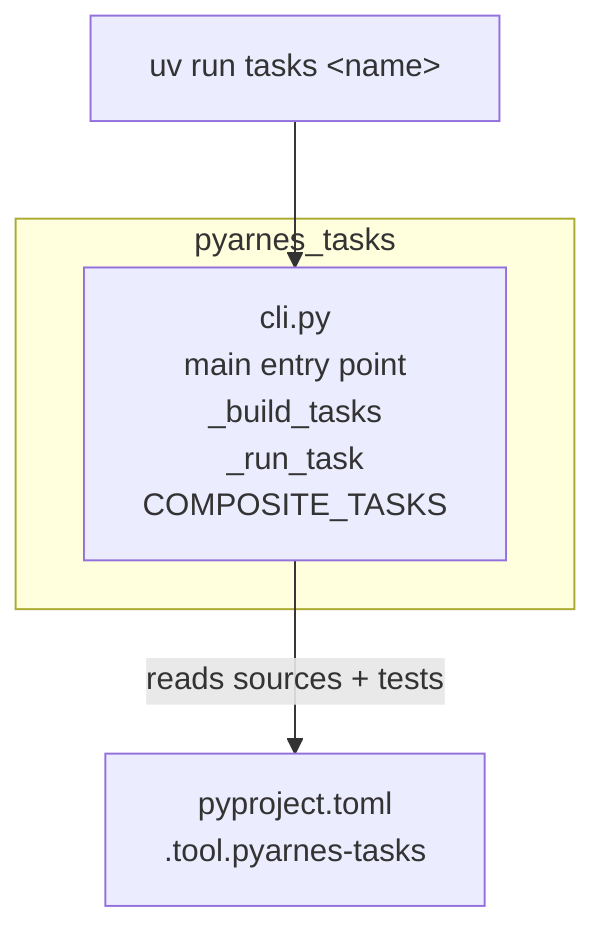
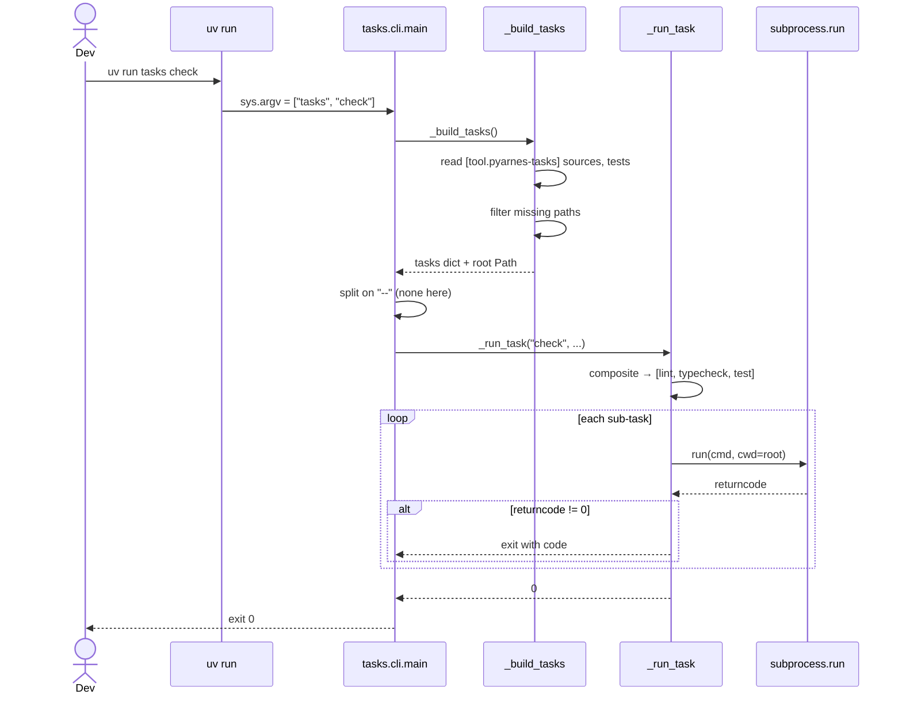
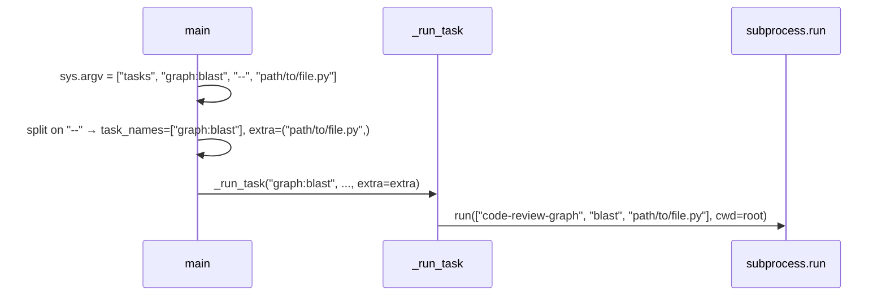

# pyarnes-tasks

Cross-platform task runner — replaces `make` with `uv run tasks <name>`. Shipped as a workspace package so it's shared between the pyarnes monorepo **and** every project bootstrapped from the template.

## Module layout



Single-file package. `cli.py` is the whole thing.

| Module | Role |
|---|---|
| `cli.py` | `main()` entry point (wired via `[project.scripts]`), `_build_tasks()` dynamically assembles the task table from `[tool.pyarnes-tasks]` in the nearest `pyproject.toml`, `_run_task()` dispatches with `--` forwarding and composite unrolling. |

## Why this package exists

- **Make doesn't run on Windows.** `pyarnes-tasks` uses only Python stdlib + `subprocess`, so it works on Linux, macOS, and Windows identically.
- **One invocation everywhere.** Whether you're inside the pyarnes monorepo or a freshly scaffolded adopter project, `uv run tasks check` does the right thing. The config lives in each repo's own `pyproject.toml`.
- **No task file.** Adopters don't write Makefiles or justfiles. They set `[tool.pyarnes-tasks] sources = [...]`, done.
- **Missing-path tolerance.** `uv run tasks check` on a scaffolded project with no `tests/` directory yet still succeeds — missing paths are filtered out, and pytest exit code 5 (no tests collected) is treated as success.
- **Not a runtime dep.** `pyarnes-tasks` is dev-infrastructure. Adopters install it as a dev dep; it never ships in a production container.

## Key flows

### `uv run tasks check`



### `-- arg` forwarding (e.g. `uv run tasks graph:blast -- path/to/file.py`)



Only the **last** task in a chain receives the `extra` tuple. Composite tasks (`check`, `ci`) ignore `extra` by design — they dispatch to sub-tasks that each take their own args.

## Public API (for package maintainers)

There is no public Python API — `pyarnes-tasks` is a CLI, not a library. The surface maintainers care about:

### Config block

```toml
[tool.pyarnes-tasks]
sources = ["src"]       # code roots (ruff / ty / bandit / radon / vulture)
tests = ["tests"]       # pytest roots (silently skipped when missing)
```

**Monorepo usage:**

```toml
[tool.pyarnes-tasks]
sources = ["packages"]
tests = ["tests"]
```

### Tasks

| Task | What it runs |
|---|---|
| `lint` | `ruff check <sources + tests>` |
| `lint:fix` | `ruff check --fix <sources + tests>` |
| `format` | `ruff format <sources + tests>` |
| `format:check` | `ruff format --check <sources + tests>` |
| `typecheck` | `ty check <sources>` |
| `test` | `pytest <tests>` (no-op if no tests) |
| `test:cov` | `pytest <tests> --cov --cov-report=term-missing` |
| `watch` / `test:watch` | `pytest-watch <tests>` |
| `security` | `bandit -r <sources> -c pyproject.toml` |
| `pylint` | `pylint <sources>` |
| `radon:cc` | Cyclomatic complexity (≥ B) |
| `radon:mi` | Maintainability index (≥ B) |
| `vulture` | Dead-code detection |
| `profile` | `pyinstrument` |
| `md-lint` / `md-format` | `pymarkdown scan .` / `mdformat .` |
| `yaml-lint` | `yamllint .` |
| `docs` | `doq -w -r <sources>` |
| `docs:serve` / `docs:build` | `mkdocs serve` / `mkdocs build` |
| `update` | `uvx copier update` |
| `graph:render` | `graphify .` (opt-in — see [MCP tools](../extend/mcp-tools.md)) |
| `graph:blast` | `code-review-graph blast` (use `-- <path>` to forward) |

### Composites

| Task | Combines |
|---|---|
| `check` | `lint` + `typecheck` + `test` |
| `ci` | `format:check` + `lint` + `typecheck` + `test:cov` + `security` |
| `complexity` | `radon:cc` + `radon:mi` |

## Extension points

- **Add a new task:** edit `_build_tasks()` in `cli.py`. Tasks are a `dict[str, list[str]]` — the key is the task name, the value is the argv to exec. Missing paths are filtered via `_existing()` — reuse it.
- **Add a composite:** append to the module-level `COMPOSITE_TASKS` dict.
- **Add a tunable:** thread it through `_load_config()` (which parses `[tool.pyarnes-tasks]`). Keep defaults sensible — adopters shouldn't need to set it.
- **Avoid custom entry points per package.** The `tasks` script is the single CLI surface. Package-specific CLIs live in that package's own `[project.scripts]`, never here.

## Hazards / stable surface

- Task names are public API for every adopter project. Renaming is a breaking change that requires a `_migrations` entry in `copier.yml`.
- The `[tool.pyarnes-tasks]` schema (`sources`, `tests`) is public. Adding new keys is fine; renaming or removing is breaking.
- The pytest-exit-5-as-success rule (no tests collected) is behavioural contract — scaffolded projects without a `tests/` dir depend on it.
- `--` as an arg separator is load-bearing — docs across the site tell adopters to use it. Don't change the convention.
- Keep `cli.py` stdlib-only. Depending on a package would pull it into every adopter's dev env.

## See also

- [Extension rules](../extend/rules.md) — why there's no CLI in `pyarnes-harness`.
- [Evolving workflow](../extend/workflow.md) — where tasks fit in the daily dev loop.
- [Optional MCP tools](../extend/mcp-tools.md) — the `graph:*` tasks and opt-in group.
- Source: [`packages/tasks/`](https://github.com/Cognitivemesh/pyarnes/tree/main/packages/tasks).
