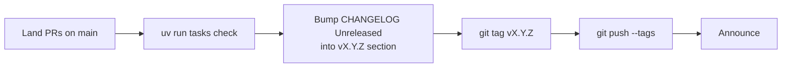

# Release workflow

pyarnes does not publish to PyPI. Adopters pin by git ref via `pyarnes_ref` in their Copier answers. A release is a signed git tag that downstream projects bump to.

!!! warning "0.x stability disclaimer"
    pyarnes is currently **v0.x**. Until we cut v1.0.0, **MINOR** releases **may** introduce breaking changes to the public surface — the semver policy below becomes binding only from v1.0.0 onward. Call this out in release notes when you bump MINOR during 0.x.

## Release flow



## Cutting a release

1. Land all PRs for the release on `main`; confirm `uv run tasks check` is green.
2. Pick a version per the [semver policy in `CHANGELOG.md`](https://github.com/Cognitivemesh/pyarnes/blob/main/CHANGELOG.md#versioning-policy):
   - **MAJOR** — a public symbol disappeared, a base-class signature changed, an error-class inheritance flipped.
   - **MINOR** — new public symbols, new optional kwargs, new built-in `Guardrail`/`Scorer` subclass.
   - **PATCH** — bug fixes, docstring changes, private-surface refactors.
3. Move `CHANGELOG.md`'s `## [Unreleased]` content into a new `## [vX.Y.Z] - YYYY-MM-DD` section. Leave `## [Unreleased]` empty for the next cycle.
4. Commit, tag, push:
   ```bash
   git tag vX.Y.Z
   git push --tags
   ```
5. Announce the tag. Adopters update by editing their `.copier-answers.yml`:
   ```yaml
   pyarnes_ref: vX.Y.Z
   ```
   then running `uv run tasks update` (wraps `uvx copier update`) followed by `uv sync` to resolve the new git URLs.

## Releasing a pinned template version

When you want generated projects to be able to pin to a stable version:

1. Make your changes on `main`, push, and ensure tests are green.
2. Tag: `git tag v0.X.0 && git push --tags`.
3. Announce the tag — developers can now bootstrap with:
   ```bash
   uvx copier copy gh:Cognitivemesh/pyarnes my-app
   # answer pyarnes_ref with "v0.X.0"
   ```
4. Existing projects can upgrade with:
   ```bash
   uv run tasks update       # copier update against the new ref
   ```

No PyPI publishing is involved — the entire distribution story rides on git URLs.

## What `uv run tasks update` does

`uv run tasks update` invokes `copier update` against the ref recorded in `.copier-answers.yml`. Copier replays every question, applies templated file updates, and leaves user edits intact where possible. Conflicts are reported as three-way merge markers the adopter resolves manually.

## What adopters commit to

When pinning a specific tag, adopters get:

- Every symbol in the public surface table (see `CHANGELOG.md`) to remain importable until the next MAJOR.
- The `ToolHandler`, `ModelClient`, `Guardrail`, and `Scorer` base-class signatures to remain stable.
- The `ToolCallLogger` JSONL **field set** to remain stable (field *order* is not guaranteed — parse as JSON, not as column-oriented text).
- The `pyarnes-tasks` CLI surface to remain stable (task names and `[tool.pyarnes-tasks]` keys).

Things adopters must **not** depend on, per the private-surface list:

- Any underscore-prefixed attribute on a public class.
- Log event string names (`"tool.pre"`, `"guardrail.command_blocked"`, …).
- The concrete type of `Lifecycle.history`.

## Stable API surface

Adopters pin pyarnes by git ref (`pyarnes_ref` in their Copier answers) and rely on a stable set of public symbols across `pyarnes-core`, `pyarnes-harness`, `pyarnes-guardrails`, and `pyarnes-bench`. The authoritative list lives in [`CHANGELOG.md`](https://github.com/Cognitivemesh/pyarnes/blob/main/CHANGELOG.md) and is enforced in CI by `tests/unit/test_stable_surface.py`.

When you change any of these packages, three rules apply:

1. **Removing or renaming a public symbol is a MAJOR change.** The stability test will fail; update the test, `CHANGELOG.md`, and plan a release announcement.
2. **Adding a new public symbol is MINOR.** Export it via `__all__`, add it to `CHANGELOG.md` and to `STABLE_SURFACE` in `tests/unit/test_stable_surface.py`.
3. **Private surfaces** — any `_`-prefixed attribute, log event string, `ToolCallLogger` JSONL field *order*, and the concrete `Lifecycle.history` list type — may change in any release. Do not depend on them from adopter code.

`pyarnes-tasks` is intentionally excluded from this contract because it's dev-infrastructure, not a library. Its stable surface is the CLI — the task names and their `[tool.pyarnes-tasks]` keys — documented in [`docs/adopter/build/tasks.md`](../adopter/build/tasks.md).

## Stability enforcement

`tests/unit/test_stable_surface.py` is the CI gate. If a public symbol disappears from any package's `__all__`, it fails. If star-importing a package yields anything outside `__all__`, it fails. If an expected symbol cannot be resolved, it fails. Keep the test in lockstep with `CHANGELOG.md`.

## See also

- [Extension rules](extend/rules.md) — the stable-surface checklist applied to every new symbol.
