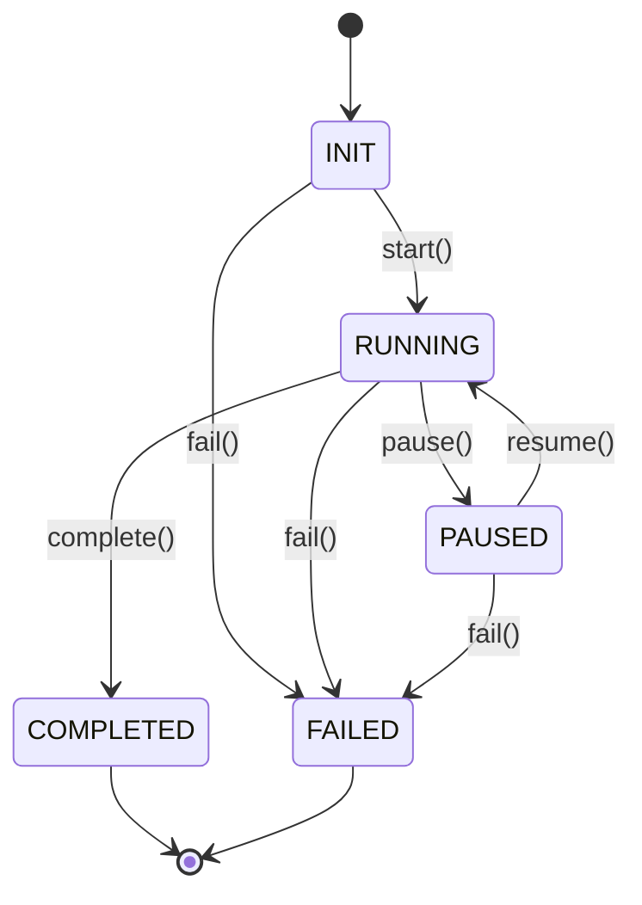

# Lifecycle

**Module:** `pyarnes_core.lifecycle`

## What it does

The `Lifecycle` class tracks what phase your agent session is in. It's a finite-state machine that enforces valid transitions and logs every change.

## State diagram



## Valid transitions

| From | Allowed targets |
|---|---|
| INIT | RUNNING, FAILED |
| RUNNING | PAUSED, COMPLETED, FAILED |
| PAUSED | RUNNING, FAILED |
| COMPLETED | *(terminal — no further transitions)* |
| FAILED | *(terminal — no further transitions)* |

## Usage

```python
from pyarnes_core.lifecycle import Lifecycle, Phase

lc = Lifecycle(metadata={"session_id": "abc123"})
lc.start()     # INIT → RUNNING
lc.pause()     # RUNNING → PAUSED
lc.resume()    # PAUSED → RUNNING
lc.complete()  # RUNNING → COMPLETED

print(lc.phase)        # Phase.COMPLETED
print(lc.is_terminal)  # True
print(lc.history)      # [{"from": "init", "to": "running", "timestamp": ...}, ...]
```

## How transitions are logged

Every call to `transition()` emits a structured log event:

```json
{"timestamp": "2026-04-17T15:00:00Z", "level": "info", "event": "lifecycle.transition from=init to=running"}
```

Invalid transitions raise `ValueError`:

```python
lc = Lifecycle()
lc.start()
lc.complete()
lc.start()  # ValueError: Invalid transition: completed → running
```

## Via the API

The lifecycle is also exposed as REST endpoints:

```bash
# Get current state
curl http://localhost:8000/api/v1/lifecycle

# Transition
curl -X POST http://localhost:8000/api/v1/lifecycle/transition \
  -H "Content-Type: application/json" \
  -d '{"action": "start"}'

# Reset back to INIT
curl -X POST http://localhost:8000/api/v1/lifecycle/reset
```

## API reference

### Phase enum

`INIT`, `RUNNING`, `PAUSED`, `COMPLETED`, `FAILED`

### Lifecycle methods

| Method | Effect |
|---|---|
| `start()` | → RUNNING |
| `pause()` | → PAUSED |
| `resume()` | → RUNNING (from PAUSED) |
| `complete()` | → COMPLETED |
| `fail()` | → FAILED |
| `transition(target)` | Direct transition (validates) |
