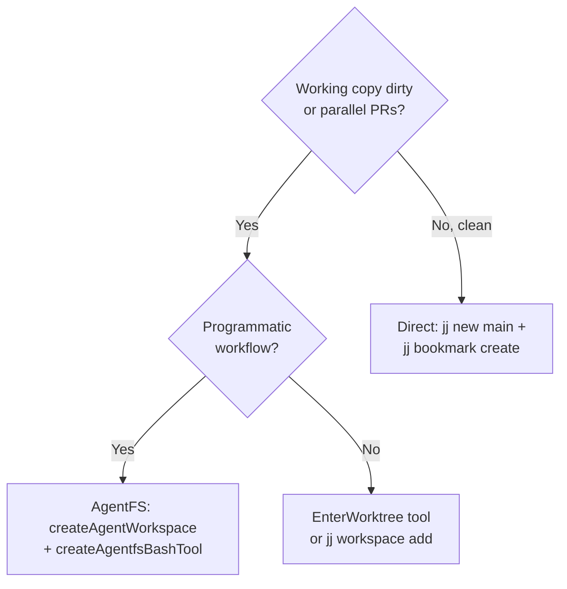

# pr-creation

Create branches/bookmarks, implement PR specs, run quality gates, and submit pull requests.
Jujutsu-native with git fallback. Complements `branch-merge` (which handles merging TO main).

## When to Use This Skill

This skill should be used when:
- Creating a new feature branch or jj bookmark for a PR
- Implementing a spec from `specs/PR-NN-*.md`
- Running pre-submission quality gates (3-tier)
- Submitting a PR via `gh pr create`
- Setting up isolated worktrees for parallel PR work
- Orchestrating multi-agent PR implementation (> 400 LOC)

This skill should NOT be used when:
- Merging a branch/bookmark into main (use `branch-merge`)
- Running code audits without a PR context (use `typescript-refactoring`)
- Rebasing or resolving conflicts on existing branches (use `branch-merge`)

## Prerequisites

| Requirement | Check Command | Required |
|-------------|---------------|----------|
| Git | `git --version` | Yes |
| jj (Jujutsu) | `jj version` | Recommended |
| gh CLI | `gh auth status` | Yes (for submission) |
| Bun | `bun --version` | Yes |
| bd (BEADS/AgentFS) | `bd --help` | Optional — graceful degradation |
| Make targets | `make help` | Yes |

## Agent Instructions (Behavioral Protocol)

Choose **Mode A** for PRs under ~400 LOC. Choose **Mode B** for larger PRs or when the spec calls for agent teams.

---

### Mode A: Single-Agent Workflow

MANDATORY SEQUENCE — execute each step in order. Before calling any script, explain why.

#### Step 1: `[Analyze]` Read Spec

```bash
ls specs/PR-${PR_NUMBER}-*.md
# Read the spec completely
```

Extract from the metadata table:
- **Branch** — the target branch name
- **Depends On** — upstream PRs that must be merged first
- **Commit Plan** — messages, file scopes, ordering
- **Verification** — gate commands to run after implementation

**HALT** if spec file is not found or required fields are missing. Ask the user for clarification.

#### Step 2: `[Analyze]` Verify Prerequisites

```bash
git log main --oneline | head -50 | grep "<upstream-branch-keyword>"
```

For each PR in "Depends On", confirm it is merged to main. **HALT** if any upstream is NOT merged.

#### Step 3: `[Plan]` Choose Isolation Strategy

Explain your reasoning, then select one:



- **EnterWorktree** — preferred for Claude Code agent sessions
- **AgentFS workspace** — for programmatic workflows with scoped FS + justBash isolation
- **`jj workspace add`** — for jj-native CLI workflows
- **Direct creation** — when working copy is clean and no parallel work needed

See [references/worktree-patterns.md](references/worktree-patterns.md) for details.

#### Step 4: `[Execute]` Create Branch

```bash
bash .ctx/skills/pr-creation/scripts/create-pr-branch.sh <branch-name> [--worktree] [--from main]
```

**Verify**: `jj bookmark list | grep <name>` or `git branch | grep <name>` shows the new branch.

#### Step 5: `[Execute]` Track with BEADS (AgentFS)

BEADS is the issue tracking component of the AgentFS package (`toolbox/packages/agentfs/`).
If `bd` CLI is available, create a tracking issue:

```bash
bd create "PR-NN: Short title" --description="Implements specs/PR-NN-*.md" -t feature -p 1 --json
bd update <id> --claim --json
```

If `bd` is not installed, log a warning and continue. See [references/agentfs-integration.md](references/agentfs-integration.md).

#### Step 6: `[Execute]` Implement Commit Plan

For each commit in the spec's Commit Plan:
1. Implement the changes described in the spec
2. Format: `bunx biome check --write .`
3. Quick smoke: `make toolbox-typecheck`
4. Stage specific files and commit with the exact message from spec:

```bash
git add <specific-files>
git commit -m "$(cat <<'EOF'
feat(package): commit message from spec

Co-Authored-By: Claude Opus 4.6 <noreply@anthropic.com>
EOF
)"
```

**Verify** each commit: `git log -1 --oneline` matches spec message. Smoke check exit 0.

#### Step 7: `[Execute]` Pre-Submission Quality Gate

```bash
# Tier 1 (dev gate — quick feedback):
bash .ctx/skills/pr-creation/scripts/pr-preflight.sh --quick

# Tier 2 (PR gate — before submission, default):
bash .ctx/skills/pr-creation/scripts/pr-preflight.sh

# Tier 3 (integration — major/cross-cutting PRs):
bash .ctx/skills/pr-creation/scripts/pr-preflight.sh --full
```

**Verify**: Exit 0. Summary table shows all PASS. `.pr-preflight-passed` marker created.
**HALT** on failure — fix issues and re-run before proceeding.

Future: When vigia is bootstrapped (PR-28+), add `vigia scan` to the gate.

#### Step 8: `[Execute]` Submit PR

```bash
bash .ctx/skills/pr-creation/scripts/pr-submit.sh --spec specs/PR-NN-*.md --branch <name>
```

Or manually:

```bash
git push -u origin <branch-name>
gh pr create --title "feat(package): short title" --body "$(cat <<'EOF'
## Summary
- Implements specs/PR-NN-*.md
- <1-3 bullet points>

## Verification
- [ ] `make toolbox-typecheck` — 22/22 pass
- [ ] `make toolbox-check` — 0 errors
- [ ] `make toolbox-ci-all` — green

## Test plan
- [ ] Existing tests pass (test freeze)
- [ ] No new TODO markers introduced

Generated with Claude Code
EOF
)"
```

**Verify**: PR URL printed. `gh pr view <url> --json state` returns OPEN. `gh pr checks <url>` shows pending/passing.

#### Step 9: `[Verify]` Final Verification

1. `gh pr checks <url>` — CI checks pending or passing
2. `git diff main..HEAD --stat` — review diff size matches expectations
3. `bd close <id> --reason "PR submitted: <url>" --json` (if BEADS was used)

#### Step 10: `[Verify]` Cleanup and Report

1. `ExitWorktree` if applicable (use `action: "keep"` to preserve changes)
2. Report summary table:

| Section | Result |
|---------|--------|
| Commits | `git log --oneline main..HEAD` |
| Typecheck | 22/22 or failures |
| Biome | 0 errors or list |
| CI Gate | pass or failures |
| PR | URL + state |
| BEADS | issue ID + status |

---

### Mode B: Multi-Agent Orchestration (3-Role Model)

For PRs > ~400 LOC. Based on the validated 3-role model (Implementor → Validator → Reviewer).

#### B1: Orchestrator — Resolve and Verify

Read spec (`specs/PR-NN-*.md`). Extract from its metadata table:
- **BRANCH** — the "Branch" field value
- **UPSTREAM** — the "Depends On" field value (list of prerequisite PRs)

Also extract from the spec body:
- **Commit Plan** (number of commits, messages, file scopes)
- **Findings** (rules to respect, especially "Do NOT" directives)
- **Verification** (quick smoke checks + full gate commands)
- **Implementation Checkpoint** (what's already done vs. remaining)

Verify all upstream PRs are merged: `git log main --oneline | head -50`. **HALT** if blocked.

#### B2: Spawn Implementor Agent

Launch sub-agent with `isolation: "worktree"` or AgentFS `createAgentWorkspace()`:

```
Prompt the Implementor agent with:
- SPEC: Read [resolved spec path] completely before starting. This is your source of truth for commit plan, file scopes, and findings.
- SKILLS: Read .ctx/skills/typescript-refactoring/SKILL.md and .ctx/skills/typescript/SKILL.md.
- CONSTRAINTS: 
  - Test freeze: NO new tests, NO behavioral test changes (unless spec grants waiver)
  - Follow the Commit Plan exactly (messages, file scopes, ordering)
  - Run `bunx biome check --write .` on changed files BEFORE each commit
  - Run the Quick Smoke Check from the spec AFTER each commit
  - Do NOT delete files unless the spec explicitly says to
  - Verify actual line numbers in files before extracting — they may have shifted
- EXECUTION:
  1. bash .ctx/skills/pr-creation/scripts/create-pr-branch.sh [BRANCH] --from main
  2. For each commit: implement → biome check → smoke check → stage and commit with exact spec message + "Co-Authored-By: Claude Opus 4.6 <noreply@anthropic.com>"
  3. After all commits: make toolbox-typecheck (must show 22 successful tasks)
  4. Report: git log, typecheck result, any issues
```

**Verify**: `git log --oneline` matches spec commit plan. Typecheck 22/22.

#### B3: Spawn Validator Agent

```
Prompt the Validator agent with:
- Run checks in order, report pass/fail:
  1. make toolbox-typecheck — 22/22 tasks
  2. make toolbox-check — Biome: 0 errors
  3. make toolbox-ci-all — full CI gate
  4. git diff main..HEAD -- toolbox/ | grep '+.*TODO' — no new TODOs
  5. git diff main..HEAD -- toolbox/__tests__/ | head -20 — test freeze check
  6. Run spec Verification section commands
- Report: "Branch [BRANCH] is MERGE READY" or list failures
  (distinguish known flakes from real issues)
```

**Known flakes** (ignore): CLI SIGKILL timeout, vigiaWorkflow metadata, extractFrontmatter round-trip, coverage ENOENT.

#### B4: Spawn Reviewer Agent

```
Prompt the Reviewer agent with:
- Get diff: git diff main..[BRANCH] -- toolbox/
- Review 3 dimensions:
  1. CODE REUSE: Existing utilities that could replace new code. Flag duplications.
  2. CODE QUALITY: Redundant wrappers, copy-paste, leaky abstractions, wrong ordering.
  3. EFFICIENCY: Missed concurrency, redundant reads, hot-path bloat.
- Per finding: [ISSUE] or [OK], severity (high/medium/low), regression or pre-existing.
- Summarize in a table. Skip nitpicks.
```

#### B5: Final Report

| Section | Result |
|---------|--------|
| Commits | `git log --oneline` |
| Typecheck | 22/22 pass or failures |
| Biome | 0 errors or list |
| CI Gate | pass or failures |
| Review | findings table |
| Status | READY TO MERGE or NEEDS FIXES |

Human approval required before push to remote.

---

## Verification

| Action | Check | Success Criteria |
|--------|-------|-----------------|
| Branch created | `jj bookmark list` or `git branch -a` | Branch exists |
| Upstream merged | `git log main --oneline \| grep <keyword>` | Found in main |
| Biome clean | `make toolbox-check` | 0 errors |
| Typecheck pass | `make toolbox-typecheck` | 22/22 tasks |
| CI green | `make toolbox-ci-all` | All steps pass |
| PR submitted | `gh pr list --head <branch>` | PR exists |
| PR checks | `gh pr checks <url>` | Pending or passing |
| BEADS tracked | `bd list --json` | Issue created and closed |

## Troubleshooting

| Issue | Cause | Resolution |
|-------|-------|------------|
| `gh pr create` blocked by hook | Preflight not run | Run `pr-preflight.sh` first |
| Merge validation fails after local CI passes | `bun` not on PATH or turbo binary mismatch in merge context | Confirm `make toolbox-ci-all` exits 0 locally, then merge with `--no-validate`: `bash .ctx/skills/branch-merge/scripts/safe-merge.sh <branch> --no-validate [--push]` |
| `gh pr create` auth failure | Not logged in | `gh auth login` |
| jj bookmark exists | Re-running after failure | `jj bookmark set <name> -r @` |
| Typecheck errors from other packages | Cross-package type drift | `make toolbox-clean && make toolbox-install` |
| Push rejected | Remote has new commits | `jj git fetch && jj rebase -d main@origin` or `git pull --rebase` |
| EnterWorktree fails | Already in worktree | ExitWorktree first |
| quality-fit new violations | Implementation introduced smells | Fix before submitting; see `typescript-refactoring` skill |
| Spec has no Commit Plan | Incomplete spec | **HALT** and ask user to complete the spec |
| Fix not reflected after rerun | `rerun-failed.sh` replayed old runs on stale SHAs | Push fix, wait 30–60s: `gh run list --branch <b> --limit 2 --json status,headSha`. Only use `rerun-failed.sh` for transient failures on latest SHA. Pass `--force-stale` to override. |

## Anti-Patterns

| Instead of... | Do this | Reason |
|---------------|---------|--------|
| `git checkout -b` in jj repo | `jj new main` + `jj bookmark create` | jj manages working copy |
| Skipping spec reading | Always read `specs/PR-NN-*.md` first | Spec is source of truth |
| Submitting without CI gate | Run `pr-preflight.sh` | CI will reject anyway |
| Manual merge to main | Use `branch-merge` skill | Safe merge has validation |
| TODO lists for tracking | `bd create` (BEADS/AgentFS) | Project standard |
| `git push --force` | `git push --force-with-lease` at most | Prevents overwriting |
| Committing without biome | `bunx biome check --write` first | Avoids formatting commits |
| Guessing branch names | Read spec metadata table | Branch field is authoritative |

## Usage Examples

### Example 1: End-to-End PR from Spec (Single-Agent)

A composed workflow that reads the spec, creates an isolated branch, implements all commits, validates, and submits.

**Prompt:**
```
I need to implement PR-15. Follow the pr-creation skill:

1. Read specs/PR-15-todo-cleanup-a.md and extract the Branch, Depends On, and Commit Plan.
2. Verify PR-12 (upstream) is merged to main.
3. Create the branch using create-pr-branch.sh with --worktree so my current work is safe.
4. Track it with BEADS: bd create "PR-15: Todo cleanup" -t task --json.
5. Implement each commit from the Commit Plan — run bunx biome check --write before each commit.
6. After all commits, run pr-preflight.sh (Tier 2 default gate).
7. If green, submit with pr-submit.sh --spec specs/PR-15-todo-cleanup-a.md --branch feat/0.2.25a-todo-cleanup.
8. Close the BEADS issue and report the summary table.
```

### Example 2: Parallel PRs with Worktree Isolation

Work on two independent PRs simultaneously without cross-contamination.

**Prompt:**
```
I want to work on PR-16 and PR-17 in parallel. Use the pr-creation skill for both:

Phase 1 — PR-16:
  - Read specs/PR-16-svg-export-thumbnails.md.
  - Create an isolated worktree: create-pr-branch.sh feat/0.2.26-svg-export --worktree.
  - Implement the commit plan in the worktree.
  - Run pr-preflight.sh --quick (Tier 1) as a fast check.

Phase 2 — PR-17 (while PR-16 is ready):
  - Read specs/PR-17-svg-symbols-analysis.md.
  - Create a second worktree: create-pr-branch.sh feat/0.2.27-svg-symbols --worktree.
  - Implement commits for PR-17.
  - Run pr-preflight.sh --quick.

Phase 3 — Submit both:
  - Run pr-preflight.sh (full Tier 2) on each worktree.
  - Submit both with pr-submit.sh.
  - Report a summary table for each PR.
```

### Example 3: Large PR with 3-Role Agent Team (Mode B)

Orchestrate Implementor, Validator, and Reviewer sub-agents for a PR over 400 LOC.

**Prompt:**
```
Implement PR-28 using the pr-creation skill Mode B (3-role agent team):

Step 0: Read specs/PR-28-C-vigia-bootstrap-pipeline.md completely. Extract Branch,
Depends On, Commit Plan, Verification, and Findings.

Step 1: Verify all upstream PRs are merged to main.

Step 2: Spawn an Implementor sub-agent in an isolated worktree (isolation: "worktree"):
  - Read the spec + typescript-refactoring skill + typescript skill.
  - Create branch with create-pr-branch.sh.
  - Implement each commit from the Commit Plan exactly.
  - bunx biome check --write before every commit. Co-Authored-By trailer on all.
  - After all commits: make toolbox-typecheck (must show 22 successful tasks).

Step 3: Spawn a Validator sub-agent:
  - make toolbox-typecheck, make toolbox-check, make toolbox-ci-all.
  - Check for new TODOs and test freeze violations.
  - Report MERGE READY or list failures (ignore known flakes).

Step 4: Spawn a Reviewer sub-agent:
  - git diff main..HEAD -- toolbox/
  - Review for code reuse, code quality, efficiency.
  - Findings table with severity and regression status.

Step 5: Show me the final report table (commits, typecheck, biome, CI, review, status).
Do NOT push until I approve.
```

### Example 4: Quality Gate + AgentFS Tracking

Run the preflight gate with BEADS tracking on an existing branch.

**Prompt:**
```
I've already implemented changes on feat/0.2.30-mcp-skill. Before I submit the PR:

1. Create a BEADS issue to track this: bd create "PR-30: MCP skill layout" -t feature --json.
2. Run the full PR quality gate: pr-preflight.sh (Tier 2).
3. If any step fails, show me which check failed and suggest a fix.
4. If all pass, submit with: pr-submit.sh --spec specs/PR-30-mcp-skill-layout-fidelity.md
   --branch feat/0.2.30-mcp-skill.
5. Close the BEADS issue with the PR URL.
6. Report the full summary: commits, gate results, PR URL, BEADS status.
```

## Usage Patterns & Automation

### Custom Skills for Repetitive Workflows

You already use skills (e.g., /simplify, pr-creation) and have 8 documentation_update + 4 git_branch_management sessions — perfect candidates for `/merge-cleanup` and `/update-specs` skills.

### Hooks: Auto-Typecheck After Edits

Auto-run typecheck after edits to catch issues immediately instead of discovering them later (7 buggy_code + 15 wrong_approach friction events observed). Configure in `.claude/settings.json`:

```json
{
  "hooks": {
    "PostToolUse": [
      {
        "matcher": "Edit|Write",
        "command": "npx tsc --noEmit 2>&1 | head -20"
      }
    ]
  }
}
```

### New Usage Patterns

#### 1. Save State Before Context Runs Out

Proactively checkpoint progress to disk when working on large multi-step tasks.

**Prompt:**
```
Before we continue, save our current plan and progress to .claude/session-state.md so we can
resume if context runs out. Include: completed steps, pending steps, any decisions made, and
files modified.
```

#### 2. Front-Load Branch State Verification

Start merge/cleanup sessions by explicitly verifying the actual merge state of all relevant branches.

**Prompt:**
```
Before doing anything else, check the actual merge status of all feature branches.
Use git log --oneline main..BRANCH for each — empty output means it's merged
(including squash merges). List each branch with its true status.
```

#### 3. Use Sub-Agents for Parallel Exploration

Leverage parallel agents for analysis-heavy sessions to cut session time and reduce context pressure.

**Prompt:**
```
Use parallel agents to analyze each package in the monorepo independently. For each package,
have an agent check: 1) unused exports, 2) duplicate utilities that exist in publisher,
3) TypeScript strict mode violations. Compile results into a single summary.
```

### On the Horizon

#### Autonomous PR Pipeline with Gate Checks

Claude can autonomously execute entire PR lifecycles — running prerequisite gate checks, implementing changes across packages, running lint/typecheck/test gates, and creating the PR — recovering gracefully when any gate fails instead of stalling.

**Prompt:**
```
Implement PR-16 end-to-end using the spec in docs/specs/pr-16.md. Before starting:
1) Verify all dependency PRs are merged to main by checking git log --oneline,
2) Create the feature branch. Then implement all changes, running `make toolbox-ci-all`
after each commit. If any gate fails, fix it before proceeding. After all commits pass
gates, create the PR with gh cli. If you hit any blocker, document it in the spec file
under a '## Blockers' section and continue with the next independent task.
```

#### Parallel Agents for Review and Validation

Spawn parallel agents to simultaneously validate TypeScript types, run tests, audit security patterns, and review code quality while the primary agent implements changes.

**Prompt:**
```
Implement the changes in docs/specs/pr-17.md using a parallel workflow. Spawn three
background agents: Agent 1 — continuously run `npx tsc --noEmit` on each saved file
and report errors. Agent 2 — run the test suite for any package you modify and report
failures immediately. Agent 3 — review each changed file for the security patterns
documented in skills/security-review.md. You (primary agent) implement the changes.
After implementation, collect all agent reports, fix any issues they found, and confirm
all three agents report clean before committing.
```

#### Self-Healing Context Across Long Sessions

Claude proactively checkpoints progress to spec files after every meaningful step, making any future session (or context-reset recovery) instantly resumable without human prompting.

**Prompt:**
```
Before starting any work, read the spec file for the current PR and check TodoWrite for
any in-progress state from a previous session. Resume from the last checkpoint if one
exists. As you work, follow this protocol: after every successful commit or failed gate,
update the spec file's '## Execution Log' section with: timestamp, what was done, current
branch state, and next step. Also update TodoWrite with remaining tasks. If you sense
you're approaching context limits, proactively write a '## Handoff Notes' section in the
spec with exact commands to resume, uncommitted file paths, and blocking issues.
```

## References

- [references/worktree-patterns.md](references/worktree-patterns.md) — 4 isolation strategies
- [references/agentfs-integration.md](references/agentfs-integration.md) — AgentFS workspace, BEADS, justBash, VigiaRuntime
- [references/spec-format.md](references/spec-format.md) — PR spec metadata format

## Scripts

- `scripts/create-pr-branch.sh` — VCS-aware branch/bookmark creation with optional worktree
- `scripts/pr-preflight.sh` — 3-tier pre-submission quality gate
- `scripts/pr-submit.sh` — gh pr create wrapper with spec-driven body
- `scripts/guard-pr-create.sh` — Claude PreToolUse hook guard (enforces preflight)

### PR Lifecycle Management

- `scripts/pr-status.sh` — Open PR dashboard with CI status, review decisions, and staleness
- `scripts/pr-comments.sh` — List and reply to PR review comments (interactive for Cursor/Claude)
- `scripts/approval.sh` — Check PR readiness and trigger auto-merge or merge queue
- `scripts/create-prs.sh` — Find agent branches without PRs and create them (reuses pr-submit.sh)
- `scripts/rerun-failed.sh` — Rerun failed GitHub Actions workflows on agent branches
- `scripts/create-issue.sh` — Create a GitHub issue with agent implementation instructions
- `scripts/update-main.sh` — Merge main into open PR branches to keep them current
